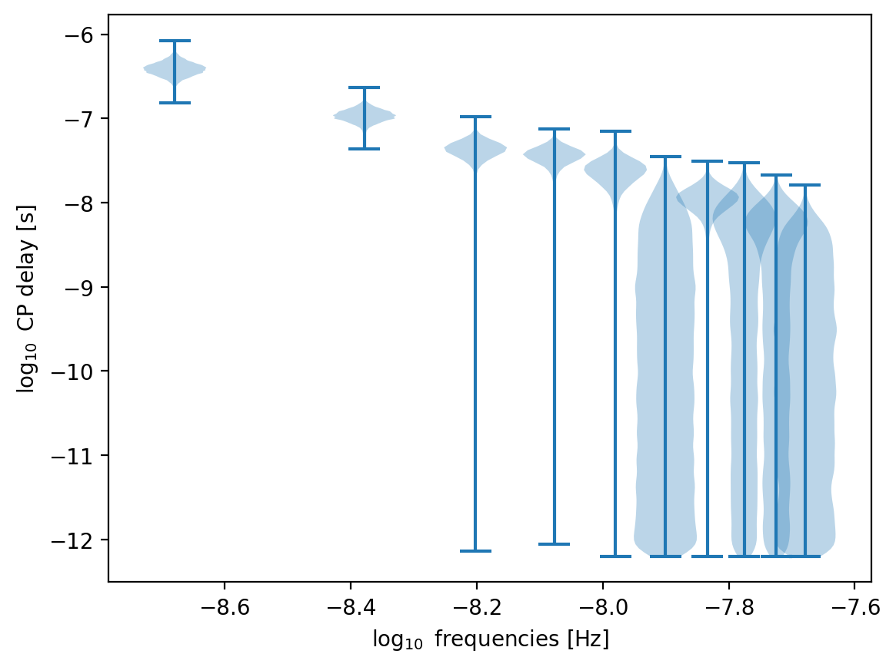
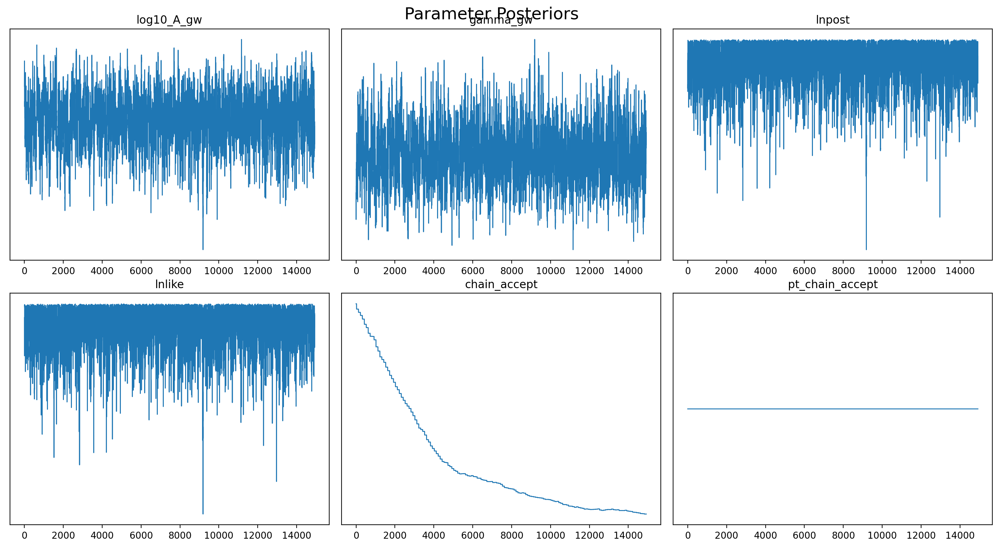
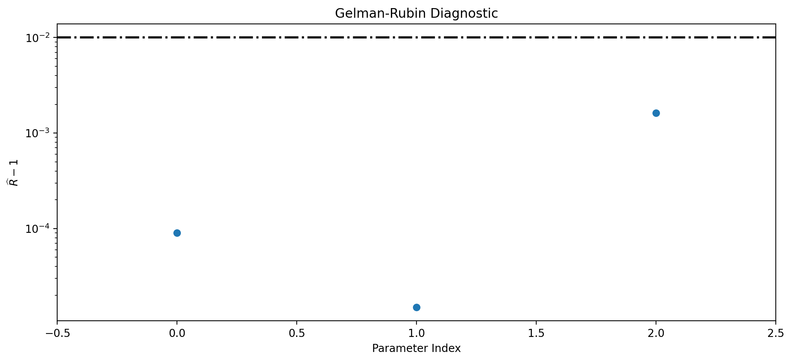
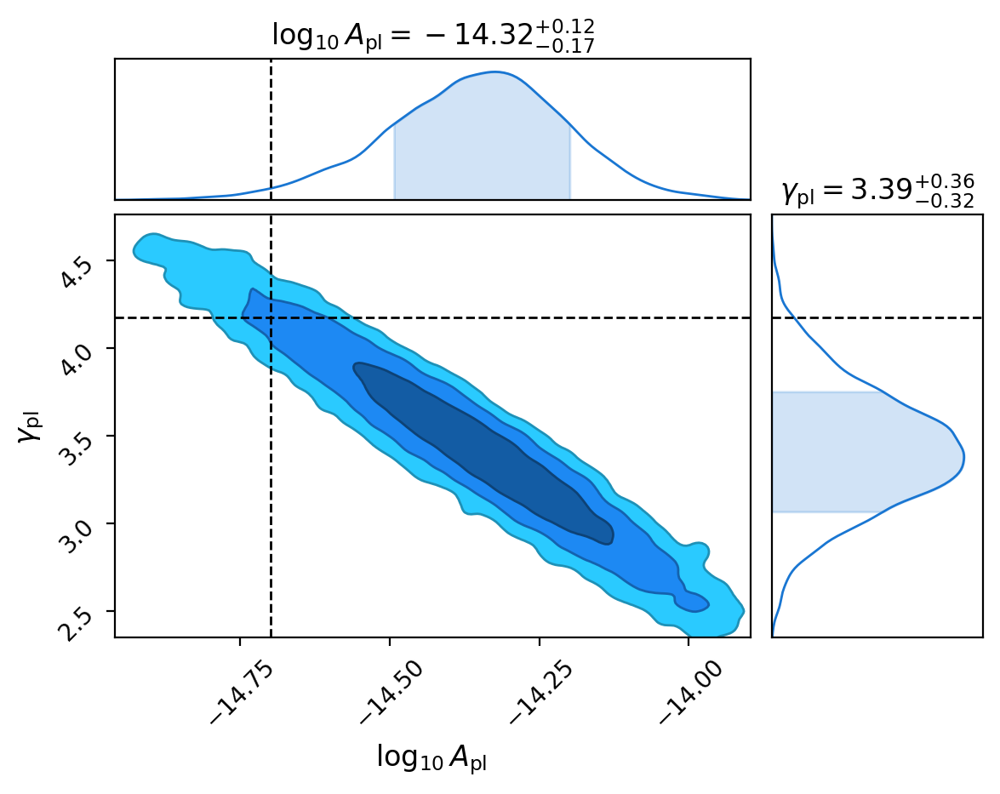
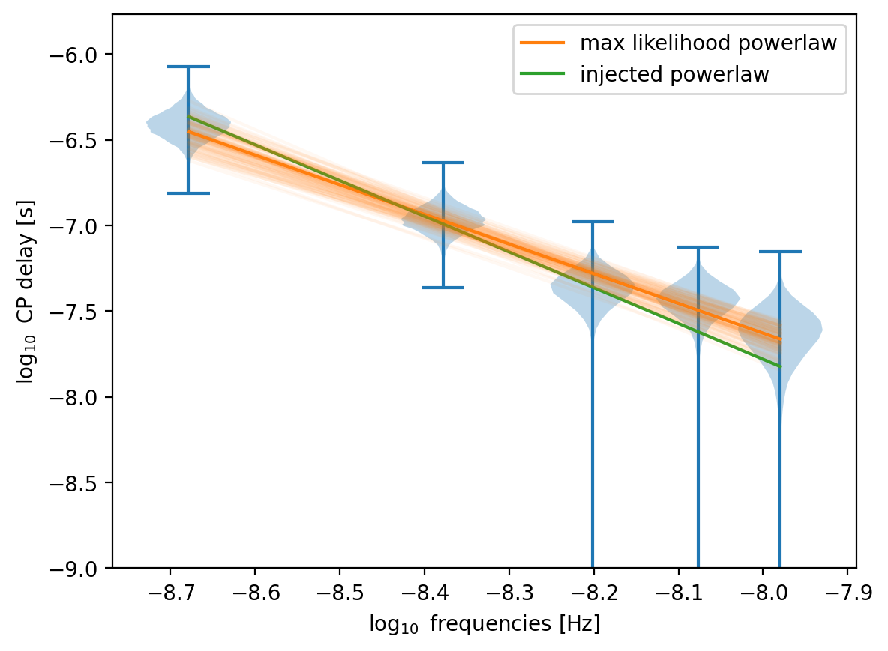
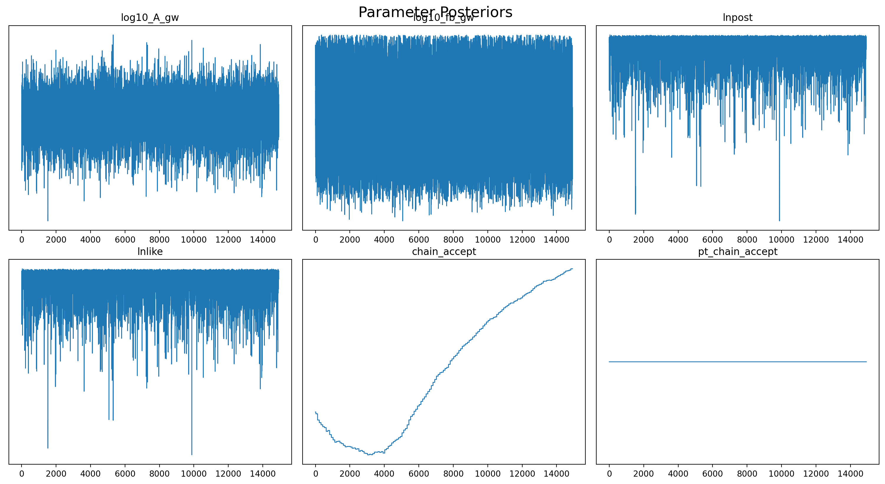
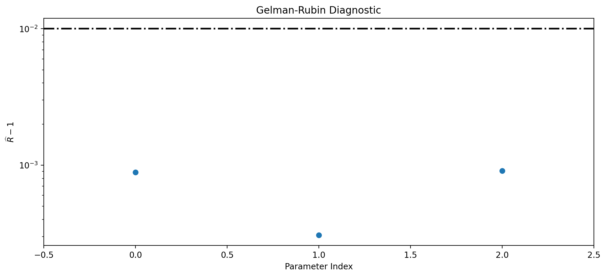
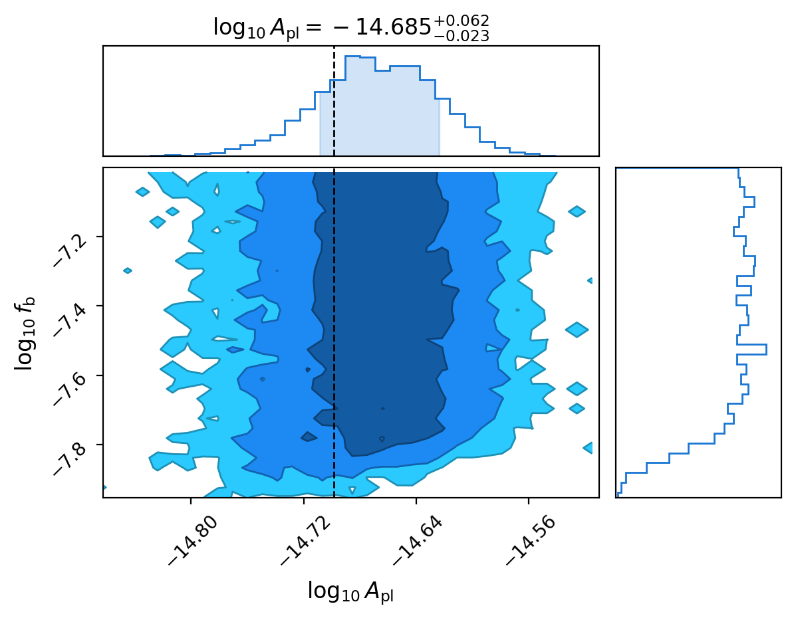
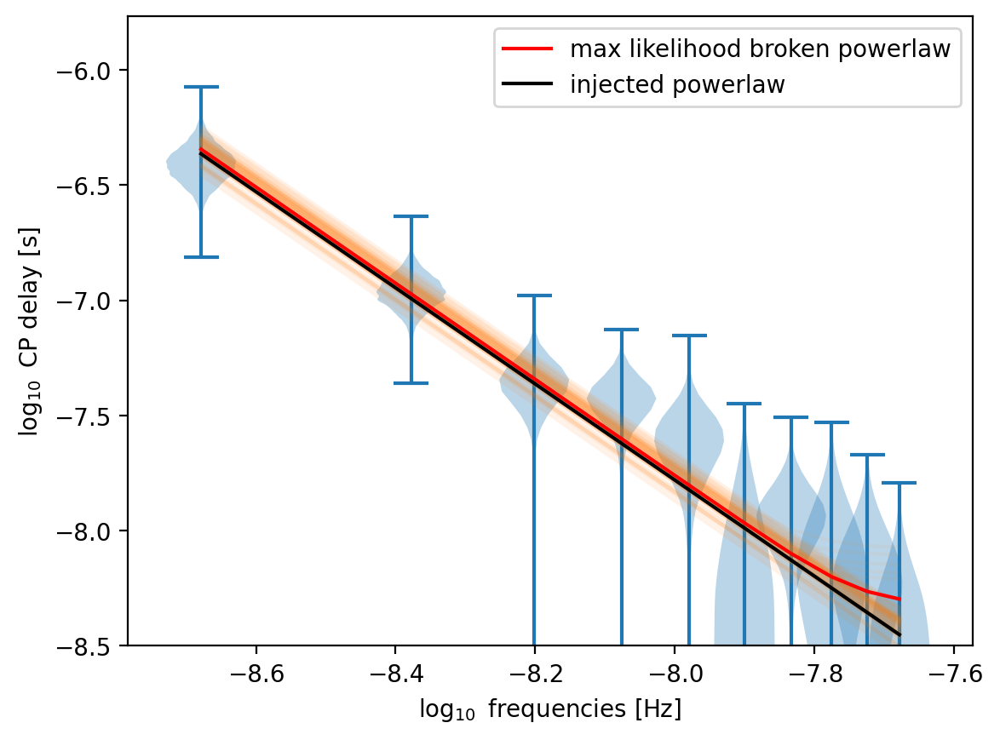

# Using *ceffyl* on a PTA free spectrum

A free spectrum of the PTA is easy to refit spectra using *ceffyl*. Simply choose your spectrum from *ceffyl.model* (or create your own function!), along with the number of frequencies that you want to search over, and let your MCMC run!

First off, let's import some required packages...


```python
%reload_ext autoreload
%autoreload 2
%config InlineBackend.figure_format ='retina'
%matplotlib inline

import numpy as np
import matplotlib.pyplot as plt
from chainconsumer.chainconsumer import ChainConsumer
from ceffyl import Ceffyl, models, Sampler, chain_utils
from enterprise.signals import parameter
import ultranest

import la_forge.core as co
import la_forge.diagnostics as dg
```

    Warning: cannot find astropy, units support will not be available.


## PTA free spectrum

The free spectrum is a model-independent analysis of the timing residuals from the PTA [(Lentati et. al. 2013)](https://journals.aps.org/prd/abstract/10.1103/PhysRevD.87.104021). For a PTA free spectrum, we typically model 30 frequency power-laws for each pulsar's intrinsic red noise, as well as a common free-spectrum process instead of an e.g power-law common process. We recover posteriors at each sampled GW frequency that represents the common process' cross-power spectrum at that frequency bin. The posteriors are represented by the coefficient $\rho$, where $$\rho^2(f_k) = \prod_{a,b}\frac{\Gamma_{pq}S_{pq}(f_k)}{T} = \prod_a\frac{S_{aa}(f_k)}{T}$$ for a pulsar $p$ at a frequency bin $f_k$ for $k \in [1, N_f]$, $S$ is the timing-residual cross-power spectrum, $T$ is the PTA timing baseline, and $\Gamma_{pq}=\delta_{pq}$ is the overlap reduction function between pulsars $p$ and $q$, which we assume to be independent, hence the Dirac delta function.

We run the free spectrum with [`enterprise`](https://github.com/nanograv/enterprise).

Let's see what the free spectrum looks like for a simulated pulsar timing array (simulation based on [Pol et. al. 2021](http://dx.doi.org/10.3847/2041-8213/abf2c9))


```python
# DON'T RUN THIS BLOCK!
# freespec = co.Core(corepath='../data/sim51/freespec_sim51/freespec_2A_30f.core')
```

    Loading data from HDF5 file....


```python
""" # DON'T RUN THIS BLOCK!
plt.violinplot(pd.DataFrame(freespec(freespec.params[-15:-5])),
               positions=np.log10(freespec.rn_freqs),
               widths=0.1)
plt.xlabel('$\log_{10}$ frequencies [Hz]')
plt.ylabel(r'$\log_{10}$ CP delay [s]')
"""
```


    Text(0, 0.5, '$\\log_{10}$ CP delay [s]')


    

    


The injected values for this simulation are:


```python
log10A_inj, gamma_inj = np.loadtxt('../data/sim51/injected_values.txt')
print(f'log10A={log10A_inj}, gamma={gamma_inj}')
```

    log10A=-14.6985, gamma=4.1727


## Now let's fit some GW models!

To fit our GW models onto our free spectrum, we must represent our posteriors as probability density functions in order to extract probabilities to build a Bayesian likelihood. Using the most optimal kernel density estimators (KDEs, see paper for details), we can create a grid of probabilities to select from.

For details on creating your own probability grids, see [link to another ipynb being developed]. However, these grids will be made for you in advance for most PTA data sets so all you have to do is use them! :)

let's initialise a Ceffyl object to approximate a PTA using the PTA free spectrum. A directory containing the KDE densities of our simulated PTA free spectrum is our input. It also contains metadata on the frequencies used, pulsar names etc.


```python
pta = Ceffyl.ceffyl(datadir='../data/sim51/freespec_sim51/')
```

Define a GW spectrum! Let's try a 5f powerlaw. The default parameters here are $\log_{10}A\in[-18,-12]$, $\gamma\in[0,7]$


```python
gw = Ceffyl.signal(psd=models.powerlaw, N_freqs=5)
```

Adding signals is easy!


```python
pta.add_signals([gw])
```


    <ceffyl.Ceffyl.ceffyl at 0x1664dff10>


Now let's setup and run our sampler


```python
sampler = Sampler.setup_sampler(pta, 
                                outdir='../data/sim51/refits/freespec/5fpl/',
                                logL=pta.ln_likelihood,
                                logp=pta.ln_prior, resume=False)
x0 = pta.initial_samples()  # get initial sample
```

    Adding GWB uniform distribution draws...
    


```python
sampler.sample(x0, int(200000))  # sample!
```

    /Users/lambwg/Applications/miniconda3/envs/enterprise/lib/python3.10/site-packages/enterprise/signals/parameter.py:62: RuntimeWarning: divide by zero encountered in log
      logpdf = np.log(self.prior(value, **kwargs))


    Finished 5.00 percent in 3.111837 s Acceptance rate = 0.158822Adding DE jump with weight 20
    Finished 99.50 percent in 59.394662 s Acceptance rate = 0.219402
    Run Complete


Let's read the data from the analysis


```python
# this compresses the output file
c0 = co.Core('../data/sim51/refits/freespec/5fpl/')
c0.set_rn_freqs(Tspan=1/freespec.rn_freqs[0], nfreqs=5)
c0.save('../data/sim51/refits/freespec/5fpl/chain.core')
pl5f = co.Core(corepath='../data/sim51/refits/freespec/5fpl/chain.core')
```

    Loading data from HDF5 file....


checking the traceplot to see if the chains converged


```python
dg.plot_chains(pl5f, hist=False)
```


    

    


let's also numerical check if it has converged. If all points are below the dashed line, we are good to go (but to be safe, you should also check if all parameters have small autocorrelations lengths too by using `emcee.autocorr`


```python
dg.plot_grubin(pl5f)
```


    

    


Let's make a corner plot!


```python
tex = [r'$\log_{10}A_\mathrm{pl}$', r'$\gamma_\mathrm{pl}$']

c = ChainConsumer()
c.add_chain(pl5f(pl5f.params[:2]),
            parameters=tex)
c.configure(usetex=False, summary=True, sigmas=[1,2,3])
c.plotter.plot(figsize=(6,4), truth=[log10A_inj, gamma_inj]);
```


    

    


The 'truth' lines are the injected powerlaw parameters. Our analysis captures the injection well within the 95% credible region. This is good, but we should compare it to a typical uncorrelated powerlaw analysis. See Fig 3. of [Lamb, Taylor & van Haasteren 2023]().

Let's take the maximum likelihood parameters from this run and plot it on the free spectrum. We'll compare it to the injected powerlaw


```python
""" # DON'T RUN THIS BLOCK!
idx = np.where(pl5f('lnpost').max()==pl5f('lnpost'))[0][0]
log10_A, gamma = pl5f.chain[pl5f.burn:][idx][:2]
pl = 0.5*np.log10(models.powerlaw(pl5f.rn_freqs,
                                  Tspan=1/pl5f.rn_freqs[0],
                                  log10_A=log10_A,
                                  gamma=gamma))

idx = np.random.randint(0, pl5f.chain[pl5f.burn:].shape[0],
                        100)
log10_A, gamma = pl5f.chain[pl5f.burn:][idx][:,:2].T
plspread = 0.5*np.log10(models.powerlaw(pl5f.rn_freqs[None,:].T,
                                        Tspan=1/pl5f.rn_freqs[0],
                                        log10_A=log10_A,
                                        gamma=gamma))

pl_inj = 0.5*np.log10(models.powerlaw(pl5f.rn_freqs,
                                      Tspan=1/pl5f.rn_freqs[0],
                                      log10_A=log10A_inj,
                                      gamma=gamma_inj))

plt.violinplot(pd.DataFrame(freespec(freespec.params[-15:-10])),
               positions=np.log10(freespec.rn_freqs[:5]),
               widths=0.1)
plt.plot(np.log10(pl5f.rn_freqs), pl, label='max likelihood powerlaw')
plt.plot(np.log10(pl5f.rn_freqs), pl_inj, label='injected powerlaw')
plt.plot(np.log10(pl5f.rn_freqs), plspread, color='C1',
         alpha=0.05)
plt.xlabel('$\log_{10}$ frequencies [Hz]')
plt.ylabel(r'$\log_{10}$ CP delay [s]')
plt.ylim(-9)
plt.legend();
"""
```


    

    


##### What if I want to try a different model?

Then just change the model function... All models supported right now are found in `ceffyl.models`. *These are equivalent to the functions in `enterprise.gp_priors`, except they're faster as the don't require repeated frequencies and they are vectorised. Note that the functions in `enterprise.gp_priors` will not work with `ceffyl`.*

What about a broken powerlaw with *fixed* $\gamma$?
We fix a value by defining it in the dictionary labelled `const_params`.


```python
# first we need to define some priors on log10_A and the break frequency, log10_fb
# it's just like defining priors in a standard enterprise run!
log10A = parameter.Uniform(-18, -12)('log10_A')
log10_fb = parameter.Uniform(-9, -7)('log10_fb')

# then we define gamma as a constant float
const_params = dict(gamma=gamma_inj)

# then we choose our model
psd = models.broken_powerlaw
```


```python
# and the create our signal! Let's try 10 frequencies
gw = Ceffyl.signal(N_freqs=10, psd=psd,
                   params=[log10A, log10_fb],
                   const_params=const_params)
```


```python
pta2 = Ceffyl.ceffyl(datadir='../data/sim51/freespec_sim51/')
pta2.add_signals([gw])
```


    <ceffyl.Ceffyl.ceffyl at 0x1678f4ee0>


```python
# and finally, we setup the sampler!
sampler = Sampler.setup_sampler(pta2,
                                outdir='../data/sim51/refits/freespec/10fbpl/',
                                logL=pta2.ln_likelihood,
                                logp=pta2.ln_prior, resume=False)
x0 = pta2.initial_samples()  # get initial sample
sampler.sample(x0, int(200000))
```

    Adding GWB uniform distribution draws...
    


    /Users/lambwg/Applications/miniconda3/envs/enterprise/lib/python3.10/site-packages/enterprise/signals/parameter.py:62: RuntimeWarning: divide by zero encountered in log
      logpdf = np.log(self.prior(value, **kwargs))


    Finished 5.00 percent in 3.479850 s Acceptance rate = 0.328178Adding DE jump with weight 20
    Finished 99.50 percent in 54.069381 s Acceptance rate = 0.447216
    Run Complete


read the chain and run convergence tests...


```python
c0 = co.Core('../data/sim51/refits/freespec/10fbpl/')
c0.set_rn_freqs(Tspan=1/freespec.rn_freqs[0], nfreqs=10)
c0.save('../data/sim51/refits/freespec/10fbpl/chain.core')
bpl10f = co.Core(corepath='../data/sim51/refits/freespec/10fbpl/chain.core')
```

    INFO:la_forge.core:Appending ['lnpost','lnlike','chain_accept','pt_chain_accept'] to end of params list.


    Loading data from HDF5 file....


```python
# checking the traceplot
dg.plot_chains(bpl10f, hist=False)
```


    

    


```python
dg.plot_grubin(bpl10f)
```


    

    


```python
# let's make a corner plot!
tex = [r'$\log_{10}A_\mathrm{pl}$', r'$\log_{10}f_\mathrm{b}$']

c = ChainConsumer()
c.add_chain(bpl10f(bpl10f.params[:2]),
            parameters=tex)
c.configure(usetex=False, summary=True, sigmas=[1,2,3],
            smooth=False)
c.plotter.plot(figsize=(6,4), truth=[log10A_inj]);
```

    WARNING:chainconsumer:Parameter $\log_{10}f_\mathrm{b}$ in chain Chain 0 is not constrained


    

    


this run really captured the injected amplitude well!


```python
"""  # DON'T RUN THIS BLOCK!
idx = np.where(bpl10f('lnpost').max()==bpl10f('lnpost'))[0][0]
log10_A, log10_fb = bpl10f.chain[bpl10f.burn:][idx][:2]

bpl = 0.5*np.log10(models.broken_powerlaw(bpl10f.rn_freqs,
                                          Tspan=1/pl5f.rn_freqs[0],
                                          log10_A=log10_A,
                                          gamma=gamma_inj, log10_fb=log10_fb))

idx = np.random.randint(0, bpl10f.chain[bpl10f.burn:].shape[0],
                        100)
log10_A, log10_fb = bpl10f.chain[bpl10f.burn:][idx][:,:2].T
plspread = 0.5*np.log10(models.broken_powerlaw(bpl10f.rn_freqs[None,:].T,
                                               Tspan=1/bpl10f.rn_freqs[0],
                                               log10_A=log10_A,
                                               gamma=gamma_inj,
                                               log10_fb=log10_fb))

pl_inj = 0.5*np.log10(models.powerlaw(bpl10f.rn_freqs,
                                      Tspan=1/bpl10f.rn_freqs[0],
                                      log10_A=log10A_inj,
                                      gamma=gamma_inj))

plt.violinplot(pd.DataFrame(freespec(freespec.params[-15:-5])),
               positions=np.log10(freespec.rn_freqs),
               widths=0.1)
plt.plot(np.log10(bpl10f.rn_freqs), plspread, color='C1', alpha=0.05)
plt.plot(np.log10(bpl10f.rn_freqs), bpl, label='max likelihood broken powerlaw',
         color='r')
plt.plot(np.log10(bpl10f.rn_freqs), pl_inj, label='injected powerlaw', color='k')
plt.xlabel('$\log_{10}$ frequencies [Hz]')
plt.ylabel(r'$\log_{10}$ CP delay [s]')
plt.ylim(-8.5)
plt.legend();
"""
```


    

    


## Defining your own spectrum model

Defining your own spectrum model is really easy! The function just needs to follow some standard input/output rules to make sure it works properly in $\textit{ceffyl}$!

**First rule:** the first two arguments should be the keywords `f` (an array of frequencies) and `Tspan` (the timespan of the data set).

**Second rule:** the input array `f` has shape ($N_f$, 1) for the PTA free spectrum analysis. This is for vectorisation purposes. You can find this array as `pta.reshaped_freqs`. The output spectrum should therefore result in a ($N_f$, 1) vector.


```python
pta.reshaped_freqs.shape
```


    (10, 1)


```python
models.powerlaw(pta.reshaped_freqs, pta.Tspan).shape
```


    (10, 1)


The arguments after `f` and `Tspan` can then be anything you want!

The returned function must be in units of $[s^2]$ corresponding to $\rho^2$, just like in `enterprise.gp_priors`.

See the [models](https://github.com/astrolamb/ceffyl/blob/main/ceffyl/models.py) script for examples

## ultranest

Model analysis with nested sampling is easy! Take your ceffyl object and easily put it your favourite nested sampler


```python
sampler1 = ultranest.ReactiveNestedSampler(pta.param_names,
                                          loglike=pta.ln_likelihood,
                                          transform=pta.transform_histogram,
                                          resume='overwrite',
                                          log_dir='../data/sim51/refits/5fpl_nested/')
```

    DEBUG:ultranest:ReactiveNestedSampler: dims=2+0, resume=False, log_dir=../data/sim0/refits/10fpl_nested/, backend=hdf5, vectorized=False, nbootstraps=30, ndraw=128..65536


```python
result1 = sampler1.run()
sampler1.print_results()
```

    [ultranest] Widening roots to 400 live points (have 400 already) ...


    INFO:ultranest:Widening roots to 400 live points (have 400 already) ...
    DEBUG:ultranest:run_iter dlogz=0.5, dKL=0.5, frac_remain=0.01, Lepsilon=0.0010, min_ess=400
    DEBUG:ultranest:max_iters=-1, max_ncalls=-1, max_num_improvement_loops=-1, min_num_live_points=400, cluster_num_live_points=40
    DEBUG:ultranest:minimal_widths_sequence: [(-inf, 400.0), (inf, 400.0)]
    DEBUG:ultranest:Plateau detected at L=-3.604365e+02, not replacing live point.
    DEBUG:ultranest:Plateau detected at L=-3.604365e+02, not replacing live point.
    DEBUG:ultranest:Plateau detected at L=-3.604365e+02, not replacing live point.
    DEBUG:ultranest:Plateau detected at L=-3.604365e+02, not replacing live point.
    DEBUG:ultranest:Plateau detected at L=-3.604365e+02, not replacing live point.
    DEBUG:ultranest:Plateau detected at L=-3.604365e+02, not replacing live point.
    DEBUG:ultranest:Plateau detected at L=-3.604365e+02, not replacing live point.
    DEBUG:ultranest:Plateau detected at L=-3.604365e+02, not replacing live point.
    DEBUG:ultranest:Plateau detected at L=-3.604365e+02, not replacing live point.
    DEBUG:ultranest:Plateau detected at L=-3.604365e+02, not replacing live point.
    DEBUG:ultranest:Plateau detected at L=-3.604365e+02, not replacing live point.
    DEBUG:ultranest:Plateau detected at L=-3.604365e+02, not replacing live point.
    DEBUG:ultranest:Plateau detected at L=-3.604365e+02, not replacing live point.
    DEBUG:ultranest:Plateau detected at L=-3.604365e+02, not replacing live point.
    DEBUG:ultranest:Plateau detected at L=-3.604365e+02, not replacing live point.
    DEBUG:ultranest:Plateau detected at L=-3.604365e+02, not replacing live point.
    DEBUG:ultranest:Plateau detected at L=-3.604365e+02, not replacing live point.
    DEBUG:ultranest:Plateau detected at L=-3.604365e+02, not replacing live point.
    DEBUG:ultranest:Plateau detected at L=-3.604365e+02, not replacing live point.
    DEBUG:ultranest:Plateau detected at L=-3.604365e+02, not replacing live point.
    DEBUG:ultranest:Plateau detected at L=-3.604365e+02, not replacing live point.
    DEBUG:ultranest:Plateau detected at L=-3.604365e+02, not replacing live point.
    DEBUG:ultranest:Plateau detected at L=-3.604365e+02, not replacing live point.
    DEBUG:ultranest:Plateau detected at L=-3.604365e+02, not replacing live point.
    DEBUG:ultranest:Plateau detected at L=-3.604365e+02, not replacing live point.
    DEBUG:ultranest:Plateau detected at L=-3.604365e+02, not replacing live point.
    DEBUG:ultranest:Plateau detected at L=-3.604365e+02, not replacing live point.
    DEBUG:ultranest:Plateau detected at L=-3.604365e+02, not replacing live point.
    DEBUG:ultranest:Plateau detected at L=-3.604365e+02, not replacing live point.
    DEBUG:ultranest:Plateau detected at L=-3.604365e+02, not replacing live point.
    DEBUG:ultranest:Plateau detected at L=-3.604365e+02, not replacing live point.
    DEBUG:ultranest:Plateau detected at L=-3.604365e+02, not replacing live point.
    DEBUG:ultranest:Plateau detected at L=-3.604365e+02, not replacing live point.
    DEBUG:ultranest:Plateau detected at L=-3.604365e+02, not replacing live point.
    DEBUG:ultranest:Plateau detected at L=-3.604365e+02, not replacing live point.
    DEBUG:ultranest:Plateau detected at L=-3.604365e+02, not replacing live point.
    DEBUG:ultranest:Plateau detected at L=-3.604365e+02, not replacing live point.
    DEBUG:ultranest:Plateau detected at L=-3.604365e+02, not replacing live point.
    DEBUG:ultranest:Plateau detected at L=-3.604365e+02, not replacing live point.
    DEBUG:ultranest:Plateau detected at L=-3.604365e+02, not replacing live point.
    DEBUG:ultranest:Plateau detected at L=-3.604365e+02, not replacing live point.
    DEBUG:ultranest:Plateau detected at L=-3.604365e+02, not replacing live point.
    DEBUG:ultranest:Plateau detected at L=-3.604365e+02, not replacing live point.
    DEBUG:ultranest:Plateau detected at L=-3.604365e+02, not replacing live point.
    DEBUG:ultranest:Plateau detected at L=-3.604365e+02, not replacing live point.
    DEBUG:ultranest:Plateau detected at L=-3.604365e+02, not replacing live point.
    DEBUG:ultranest:Plateau detected at L=-3.604365e+02, not replacing live point.
    DEBUG:ultranest:Plateau detected at L=-3.604365e+02, not replacing live point.
    DEBUG:ultranest:Plateau detected at L=-3.604365e+02, not replacing live point.
    DEBUG:ultranest:Plateau detected at L=-3.604365e+02, not replacing live point.
    DEBUG:ultranest:Plateau detected at L=-3.604365e+02, not replacing live point.
    DEBUG:ultranest:Plateau detected at L=-3.604365e+02, not replacing live point.
    DEBUG:ultranest:Plateau detected at L=-3.604365e+02, not replacing live point.
    DEBUG:ultranest:Plateau detected at L=-3.604365e+02, not replacing live point.
    DEBUG:ultranest:Plateau detected at L=-3.604365e+02, not replacing live point.
    DEBUG:ultranest:Plateau detected at L=-3.604365e+02, not replacing live point.
    DEBUG:ultranest:Plateau detected at L=-3.604365e+02, not replacing live point.
    DEBUG:ultranest:Plateau detected at L=-3.604365e+02, not replacing live point.
    DEBUG:ultranest:Plateau detected at L=-3.604365e+02, not replacing live point.
    DEBUG:ultranest:Plateau detected at L=-3.604365e+02, not replacing live point.
    DEBUG:ultranest:Plateau detected at L=-3.604365e+02, not replacing live point.
    DEBUG:ultranest:Plateau detected at L=-3.604365e+02, not replacing live point.
    DEBUG:ultranest:Plateau detected at L=-3.604365e+02, not replacing live point.
    DEBUG:ultranest:Plateau detected at L=-3.604365e+02, not replacing live point.
    DEBUG:ultranest:Plateau detected at L=-3.604365e+02, not replacing live point.
    DEBUG:ultranest:Plateau detected at L=-3.604365e+02, not replacing live point.
    DEBUG:ultranest:Plateau detected at L=-3.604365e+02, not replacing live point.
    DEBUG:ultranest:Plateau detected at L=-3.604365e+02, not replacing live point.
    DEBUG:ultranest:Plateau detected at L=-3.604365e+02, not replacing live point.
    DEBUG:ultranest:Plateau detected at L=-3.604365e+02, not replacing live point.
    DEBUG:ultranest:Plateau detected at L=-3.604365e+02, not replacing live point.
    DEBUG:ultranest:Plateau detected at L=-3.604365e+02, not replacing live point.
    DEBUG:ultranest:Plateau detected at L=-3.604365e+02, not replacing live point.
    DEBUG:ultranest:Plateau detected at L=-3.604365e+02, not replacing live point.
    DEBUG:ultranest:Plateau detected at L=-3.604365e+02, not replacing live point.
    DEBUG:ultranest:Plateau detected at L=-3.604365e+02, not replacing live point.
    DEBUG:ultranest:Plateau detected at L=-3.604365e+02, not replacing live point.
    DEBUG:ultranest:Plateau detected at L=-3.604365e+02, not replacing live point.
    DEBUG:ultranest:Plateau detected at L=-3.604365e+02, not replacing live point.
    DEBUG:ultranest:Plateau detected at L=-3.604365e+02, not replacing live point.
    DEBUG:ultranest:Plateau detected at L=-3.604365e+02, not replacing live point.
    DEBUG:ultranest:Plateau detected at L=-3.604365e+02, not replacing live point.
    DEBUG:ultranest:Plateau detected at L=-3.604365e+02, not replacing live point.
    DEBUG:ultranest:Plateau detected at L=-3.604365e+02, not replacing live point.
    DEBUG:ultranest:Plateau detected at L=-3.604365e+02, not replacing live point.
    DEBUG:ultranest:Plateau detected at L=-3.604365e+02, not replacing live point.
    DEBUG:ultranest:Plateau detected at L=-3.604365e+02, not replacing live point.
    DEBUG:ultranest:Plateau detected at L=-3.604365e+02, not replacing live point.
    DEBUG:ultranest:Plateau detected at L=-3.604365e+02, not replacing live point.
    DEBUG:ultranest:Plateau detected at L=-3.604365e+02, not replacing live point.
    DEBUG:ultranest:Plateau detected at L=-3.604365e+02, not replacing live point.
    DEBUG:ultranest:Plateau detected at L=-3.604365e+02, not replacing live point.
    DEBUG:ultranest:Plateau detected at L=-3.604365e+02, not replacing live point.
    DEBUG:ultranest:Plateau detected at L=-3.604365e+02, not replacing live point.
    DEBUG:ultranest:Plateau detected at L=-5.506442e+01, not replacing live point.
    DEBUG:ultranest:Plateau detected at L=-5.506442e+01, not replacing live point.
    DEBUG:ultranest:Plateau detected at L=-5.506442e+01, not replacing live point.
    DEBUG:ultranest:Plateau detected at L=-5.506442e+01, not replacing live point.
    DEBUG:ultranest:Plateau detected at L=-5.504689e+01, not replacing live point.
    DEBUG:ultranest:Plateau detected at L=-1.090260e+01, not replacing live point.
    DEBUG:ultranest:Plateau detected at L=-1.078723e+01, not replacing live point.
    DEBUG:ultranest:Plateau detected at L=-1.067883e+01, not replacing live point.
    DEBUG:ultranest:Plateau detected at L=-1.066836e+01, not replacing live point.
    DEBUG:ultranest:Plateau detected at L=-1.059681e+01, not replacing live point.
    DEBUG:ultranest:Plateau detected at L=-1.056498e+01, not replacing live point.
    DEBUG:ultranest:Plateau detected at L=-1.055611e+01, not replacing live point.
    DEBUG:ultranest:Plateau detected at L=-1.052026e+01, not replacing live point.
    DEBUG:ultranest:Plateau detected at L=-1.047774e+01, not replacing live point.
    DEBUG:ultranest:Plateau detected at L=-1.047426e+01, not replacing live point.
    DEBUG:ultranest:Plateau detected at L=-1.047426e+01, not replacing live point.
    DEBUG:ultranest:Plateau detected at L=-1.047153e+01, not replacing live point.
    DEBUG:ultranest:Plateau detected at L=-1.046172e+01, not replacing live point.
    DEBUG:ultranest:Plateau detected at L=-1.046087e+01, not replacing live point.
    DEBUG:ultranest:Plateau detected at L=-1.045287e+01, not replacing live point.
    DEBUG:ultranest:Plateau detected at L=-1.043102e+01, not replacing live point.
    DEBUG:ultranest:Plateau detected at L=-1.043021e+01, not replacing live point.
    DEBUG:ultranest:Plateau detected at L=-1.042903e+01, not replacing live point.
    DEBUG:ultranest:Plateau detected at L=-1.042903e+01, not replacing live point.


    [ultranest] Explored until L=-1e+01  


    INFO:ultranest:Explored until L=-1e+01  


    [ultranest] Likelihood function evaluations: 6444


    INFO:ultranest:Likelihood function evaluations: 6444


    [ultranest] Writing samples and results to disk ...


    INFO:ultranest:Writing samples and results to disk ...


    [ultranest] Writing samples and results to disk ... done


    INFO:ultranest:Writing samples and results to disk ... done
    DEBUG:ultranest:did a run_iter pass!


    [ultranest]   logZ = -16.65 +- 0.08207


    INFO:ultranest:  logZ = -16.65 +- 0.08207


    [ultranest] Effective samples strategy satisfied (ESS = 1334.9, need >400)


    INFO:ultranest:Effective samples strategy satisfied (ESS = 1334.9, need >400)


    [ultranest] Posterior uncertainty strategy is satisfied (KL: 0.48+-0.08 nat, need <0.50 nat)


    INFO:ultranest:Posterior uncertainty strategy is satisfied (KL: 0.48+-0.08 nat, need <0.50 nat)


    [ultranest] Evidency uncertainty strategy is satisfied (dlogz=0.08, need <0.5)


    INFO:ultranest:Evidency uncertainty strategy is satisfied (dlogz=0.08, need <0.5)


    [ultranest]   logZ error budget: single: 0.13 bs:0.08 tail:0.01 total:0.08 required:<0.50


    INFO:ultranest:  logZ error budget: single: 0.13 bs:0.08 tail:0.01 total:0.08 required:<0.50


    [ultranest] done iterating.


    INFO:ultranest:done iterating.


    
    logZ = -16.644 +- 0.148
      single instance: logZ = -16.644 +- 0.111
      bootstrapped   : logZ = -16.649 +- 0.148
      tail           : logZ = +- 0.013
    insert order U test : converged: True correlation: inf iterations
    
        log10_A_gw          : -16.57│ ▁▁▁▁▁▁▁▁▁▁▁▁▁▁▁▁▁▁▁▁▁▂▂▂▄▅▆▇▇▅▄▃▁▁▁▁▁ │-14.28    -14.93 +- 0.22
        gamma_gw            : 2.56  │ ▁▁▁▁▁▁▂▃▅▆▆▇▇▇▆▄▃▂▁▁▁▁▁▁▁▁▁▁▁▁▁▁▁▁▁▁▁▁│6.84      4.04 +- 0.46
    


```python
sampler2 = ultranest.ReactiveNestedSampler(pta2.param_names,
                                           loglike=pta2.ln_likelihood,
                                           transform=pta2.transform_histogram,
                                           resume='overwrite',
                                           log_dir='../data/sim0/refits/10fbpl_nested/')
```

    DEBUG:ultranest:ReactiveNestedSampler: dims=2+0, resume=False, log_dir=../data/sim0/refits/10fbpl_nested/, backend=hdf5, vectorized=False, nbootstraps=30, ndraw=128..65536


```python
result2 = sampler2.run()
sampler2.print_results()
```

    [ultranest] Sampling 400 live points from prior ...


    INFO:ultranest:Sampling 400 live points from prior ...
    DEBUG:ultranest:run_iter dlogz=0.5, dKL=0.5, frac_remain=0.01, Lepsilon=0.0010, min_ess=400
    DEBUG:ultranest:max_iters=-1, max_ncalls=-1, max_num_improvement_loops=-1, min_num_live_points=400, cluster_num_live_points=40
    DEBUG:ultranest:minimal_widths_sequence: [(-inf, 400.0), (inf, 400.0)]
    DEBUG:ultranest:Plateau detected at L=-3.604365e+02, not replacing live point.
    DEBUG:ultranest:Plateau detected at L=-3.604365e+02, not replacing live point.
    DEBUG:ultranest:Plateau detected at L=-3.604365e+02, not replacing live point.
    DEBUG:ultranest:Plateau detected at L=-3.604365e+02, not replacing live point.
    DEBUG:ultranest:Plateau detected at L=-3.604365e+02, not replacing live point.
    DEBUG:ultranest:Plateau detected at L=-3.604365e+02, not replacing live point.
    DEBUG:ultranest:Plateau detected at L=-3.604365e+02, not replacing live point.
    DEBUG:ultranest:Plateau detected at L=-3.604365e+02, not replacing live point.
    DEBUG:ultranest:Plateau detected at L=-3.604365e+02, not replacing live point.
    DEBUG:ultranest:Plateau detected at L=-3.604365e+02, not replacing live point.
    DEBUG:ultranest:Plateau detected at L=-3.604365e+02, not replacing live point.
    DEBUG:ultranest:Plateau detected at L=-3.604365e+02, not replacing live point.
    DEBUG:ultranest:Plateau detected at L=-3.604365e+02, not replacing live point.
    DEBUG:ultranest:Plateau detected at L=-3.604365e+02, not replacing live point.
    DEBUG:ultranest:Plateau detected at L=-3.604365e+02, not replacing live point.
    DEBUG:ultranest:Plateau detected at L=-3.604365e+02, not replacing live point.
    DEBUG:ultranest:Plateau detected at L=-3.604365e+02, not replacing live point.
    DEBUG:ultranest:Plateau detected at L=-3.604365e+02, not replacing live point.
    DEBUG:ultranest:Plateau detected at L=-3.604365e+02, not replacing live point.
    DEBUG:ultranest:Plateau detected at L=-3.604365e+02, not replacing live point.
    DEBUG:ultranest:Plateau detected at L=-3.604365e+02, not replacing live point.
    DEBUG:ultranest:Plateau detected at L=-3.604365e+02, not replacing live point.
    DEBUG:ultranest:Plateau detected at L=-3.604365e+02, not replacing live point.
    DEBUG:ultranest:Plateau detected at L=-3.604365e+02, not replacing live point.
    DEBUG:ultranest:Plateau detected at L=-3.604365e+02, not replacing live point.
    DEBUG:ultranest:Plateau detected at L=-3.604365e+02, not replacing live point.
    DEBUG:ultranest:Plateau detected at L=-3.604365e+02, not replacing live point.
    DEBUG:ultranest:Plateau detected at L=-3.604365e+02, not replacing live point.
    DEBUG:ultranest:Plateau detected at L=-3.604365e+02, not replacing live point.
    DEBUG:ultranest:Plateau detected at L=-3.604365e+02, not replacing live point.
    DEBUG:ultranest:Plateau detected at L=-3.604365e+02, not replacing live point.
    DEBUG:ultranest:Plateau detected at L=-3.604365e+02, not replacing live point.
    DEBUG:ultranest:Plateau detected at L=-3.604365e+02, not replacing live point.
    DEBUG:ultranest:Plateau detected at L=-3.604365e+02, not replacing live point.
    DEBUG:ultranest:Plateau detected at L=-3.604365e+02, not replacing live point.
    DEBUG:ultranest:Plateau detected at L=-3.604365e+02, not replacing live point.
    DEBUG:ultranest:Plateau detected at L=-3.604365e+02, not replacing live point.
    DEBUG:ultranest:Plateau detected at L=-3.604365e+02, not replacing live point.
    DEBUG:ultranest:Plateau detected at L=-3.604365e+02, not replacing live point.
    DEBUG:ultranest:Plateau detected at L=-3.604365e+02, not replacing live point.
    DEBUG:ultranest:Plateau detected at L=-3.604365e+02, not replacing live point.
    DEBUG:ultranest:Plateau detected at L=-3.604365e+02, not replacing live point.
    DEBUG:ultranest:Plateau detected at L=-3.604365e+02, not replacing live point.
    DEBUG:ultranest:Plateau detected at L=-3.604365e+02, not replacing live point.
    DEBUG:ultranest:Plateau detected at L=-3.604365e+02, not replacing live point.
    DEBUG:ultranest:Plateau detected at L=-3.604365e+02, not replacing live point.
    DEBUG:ultranest:Plateau detected at L=-3.604365e+02, not replacing live point.
    DEBUG:ultranest:Plateau detected at L=-3.604365e+02, not replacing live point.
    DEBUG:ultranest:Plateau detected at L=-3.604365e+02, not replacing live point.
    DEBUG:ultranest:Plateau detected at L=-3.604365e+02, not replacing live point.
    DEBUG:ultranest:Plateau detected at L=-3.604365e+02, not replacing live point.
    DEBUG:ultranest:Plateau detected at L=-3.604365e+02, not replacing live point.
    DEBUG:ultranest:Plateau detected at L=-3.604365e+02, not replacing live point.
    DEBUG:ultranest:Plateau detected at L=-3.604365e+02, not replacing live point.
    DEBUG:ultranest:Plateau detected at L=-3.604365e+02, not replacing live point.
    DEBUG:ultranest:Plateau detected at L=-3.604365e+02, not replacing live point.
    DEBUG:ultranest:Plateau detected at L=-3.604365e+02, not replacing live point.
    DEBUG:ultranest:Plateau detected at L=-3.604365e+02, not replacing live point.
    DEBUG:ultranest:Plateau detected at L=-3.604365e+02, not replacing live point.
    DEBUG:ultranest:Plateau detected at L=-3.604365e+02, not replacing live point.
    DEBUG:ultranest:Plateau detected at L=-3.604365e+02, not replacing live point.
    DEBUG:ultranest:Plateau detected at L=-3.604365e+02, not replacing live point.
    DEBUG:ultranest:Plateau detected at L=-3.604365e+02, not replacing live point.
    DEBUG:ultranest:Plateau detected at L=-3.604365e+02, not replacing live point.
    DEBUG:ultranest:Plateau detected at L=-3.604365e+02, not replacing live point.
    DEBUG:ultranest:Plateau detected at L=-3.604365e+02, not replacing live point.
    DEBUG:ultranest:Plateau detected at L=-3.604365e+02, not replacing live point.
    DEBUG:ultranest:Plateau detected at L=-3.604365e+02, not replacing live point.
    DEBUG:ultranest:Plateau detected at L=-3.604365e+02, not replacing live point.
    DEBUG:ultranest:Plateau detected at L=-3.604365e+02, not replacing live point.
    DEBUG:ultranest:Plateau detected at L=-3.604365e+02, not replacing live point.
    DEBUG:ultranest:Plateau detected at L=-3.604365e+02, not replacing live point.
    DEBUG:ultranest:Plateau detected at L=-3.604365e+02, not replacing live point.
    DEBUG:ultranest:Plateau detected at L=-3.604365e+02, not replacing live point.
    DEBUG:ultranest:Plateau detected at L=-3.604365e+02, not replacing live point.
    DEBUG:ultranest:Plateau detected at L=-3.604365e+02, not replacing live point.
    DEBUG:ultranest:Plateau detected at L=-3.604365e+02, not replacing live point.
    DEBUG:ultranest:Plateau detected at L=-3.604365e+02, not replacing live point.
    DEBUG:ultranest:Plateau detected at L=-3.604365e+02, not replacing live point.
    DEBUG:ultranest:Plateau detected at L=-3.604365e+02, not replacing live point.
    DEBUG:ultranest:Plateau detected at L=-3.604365e+02, not replacing live point.
    DEBUG:ultranest:Plateau detected at L=-3.604365e+02, not replacing live point.
    DEBUG:ultranest:Plateau detected at L=-3.604365e+02, not replacing live point.
    DEBUG:ultranest:Plateau detected at L=-3.604365e+02, not replacing live point.
    DEBUG:ultranest:Plateau detected at L=-3.604365e+02, not replacing live point.
    DEBUG:ultranest:Plateau detected at L=-3.604365e+02, not replacing live point.
    DEBUG:ultranest:Plateau detected at L=-3.604365e+02, not replacing live point.
    DEBUG:ultranest:Plateau detected at L=-3.604365e+02, not replacing live point.
    DEBUG:ultranest:Plateau detected at L=-3.604365e+02, not replacing live point.
    DEBUG:ultranest:Plateau detected at L=-3.604365e+02, not replacing live point.
    DEBUG:ultranest:Plateau detected at L=-3.604365e+02, not replacing live point.
    DEBUG:ultranest:Plateau detected at L=-3.604365e+02, not replacing live point.
    DEBUG:ultranest:Plateau detected at L=-3.604365e+02, not replacing live point.
    DEBUG:ultranest:Plateau detected at L=-3.604365e+02, not replacing live point.
    DEBUG:ultranest:Plateau detected at L=-3.604365e+02, not replacing live point.
    DEBUG:ultranest:Plateau detected at L=-3.604365e+02, not replacing live point.
    DEBUG:ultranest:Plateau detected at L=-3.604365e+02, not replacing live point.
    DEBUG:ultranest:Plateau detected at L=-3.604365e+02, not replacing live point.
    DEBUG:ultranest:Plateau detected at L=-3.604365e+02, not replacing live point.
    DEBUG:ultranest:Plateau detected at L=-3.604365e+02, not replacing live point.
    DEBUG:ultranest:Plateau detected at L=-3.604365e+02, not replacing live point.
    DEBUG:ultranest:Plateau detected at L=-3.604365e+02, not replacing live point.
    DEBUG:ultranest:Plateau detected at L=-3.604365e+02, not replacing live point.
    DEBUG:ultranest:Plateau detected at L=-3.604365e+02, not replacing live point.
    DEBUG:ultranest:Plateau detected at L=-3.604365e+02, not replacing live point.
    DEBUG:ultranest:Plateau detected at L=-3.604365e+02, not replacing live point.
    DEBUG:ultranest:Plateau detected at L=-3.604365e+02, not replacing live point.
    DEBUG:ultranest:Plateau detected at L=-3.604365e+02, not replacing live point.
    DEBUG:ultranest:Plateau detected at L=-3.604365e+02, not replacing live point.
    DEBUG:ultranest:Plateau detected at L=-3.604365e+02, not replacing live point.
    DEBUG:ultranest:Plateau detected at L=-3.604365e+02, not replacing live point.
    DEBUG:ultranest:Plateau detected at L=-3.604365e+02, not replacing live point.
    DEBUG:ultranest:Plateau detected at L=-3.604365e+02, not replacing live point.
    DEBUG:ultranest:Plateau detected at L=-3.604365e+02, not replacing live point.
    DEBUG:ultranest:Plateau detected at L=-3.604365e+02, not replacing live point.
    DEBUG:ultranest:Plateau detected at L=-3.604365e+02, not replacing live point.
    DEBUG:ultranest:Plateau detected at L=-3.604365e+02, not replacing live point.
    DEBUG:ultranest:Plateau detected at L=-3.604365e+02, not replacing live point.
    DEBUG:ultranest:Plateau detected at L=-3.604365e+02, not replacing live point.
    DEBUG:ultranest:Plateau detected at L=-3.604365e+02, not replacing live point.
    DEBUG:ultranest:Plateau detected at L=-3.604365e+02, not replacing live point.
    DEBUG:ultranest:Plateau detected at L=-3.604365e+02, not replacing live point.
    DEBUG:ultranest:Plateau detected at L=-3.604365e+02, not replacing live point.
    DEBUG:ultranest:Plateau detected at L=-3.604365e+02, not replacing live point.
    DEBUG:ultranest:Plateau detected at L=-3.604365e+02, not replacing live point.
    DEBUG:ultranest:Plateau detected at L=-3.604365e+02, not replacing live point.
    DEBUG:ultranest:Plateau detected at L=-3.604365e+02, not replacing live point.
    DEBUG:ultranest:Plateau detected at L=-3.604365e+02, not replacing live point.
    DEBUG:ultranest:Plateau detected at L=-3.604365e+02, not replacing live point.
    DEBUG:ultranest:Plateau detected at L=-3.604365e+02, not replacing live point.
    DEBUG:ultranest:Plateau detected at L=-3.604365e+02, not replacing live point.
    DEBUG:ultranest:Plateau detected at L=-3.604365e+02, not replacing live point.
    DEBUG:ultranest:Plateau detected at L=-3.604365e+02, not replacing live point.
    DEBUG:ultranest:Plateau detected at L=-3.604365e+02, not replacing live point.
    DEBUG:ultranest:Plateau detected at L=-3.604365e+02, not replacing live point.
    DEBUG:ultranest:Plateau detected at L=-3.604365e+02, not replacing live point.
    DEBUG:ultranest:Plateau detected at L=-3.604365e+02, not replacing live point.
    DEBUG:ultranest:Plateau detected at L=-3.604365e+02, not replacing live point.
    DEBUG:ultranest:Plateau detected at L=-3.604365e+02, not replacing live point.
    DEBUG:ultranest:Plateau detected at L=-3.604365e+02, not replacing live point.
    DEBUG:ultranest:Plateau detected at L=-3.604365e+02, not replacing live point.
    DEBUG:ultranest:Plateau detected at L=-3.604365e+02, not replacing live point.
    DEBUG:ultranest:Plateau detected at L=-3.604365e+02, not replacing live point.
    DEBUG:ultranest:Plateau detected at L=-3.604365e+02, not replacing live point.
    DEBUG:ultranest:Plateau detected at L=-3.604365e+02, not replacing live point.
    DEBUG:ultranest:Plateau detected at L=-3.604365e+02, not replacing live point.
    DEBUG:ultranest:Plateau detected at L=-3.604365e+02, not replacing live point.
    DEBUG:ultranest:Plateau detected at L=-3.604365e+02, not replacing live point.
    DEBUG:ultranest:Plateau detected at L=-3.604365e+02, not replacing live point.
    DEBUG:ultranest:Plateau detected at L=-3.604365e+02, not replacing live point.
    DEBUG:ultranest:Plateau detected at L=-3.604365e+02, not replacing live point.
    DEBUG:ultranest:Plateau detected at L=-3.604365e+02, not replacing live point.
    DEBUG:ultranest:Plateau detected at L=-3.604365e+02, not replacing live point.
    DEBUG:ultranest:Plateau detected at L=-3.604365e+02, not replacing live point.
    DEBUG:ultranest:Plateau detected at L=-3.604365e+02, not replacing live point.
    DEBUG:ultranest:Plateau detected at L=-3.604365e+02, not replacing live point.
    DEBUG:ultranest:Plateau detected at L=-3.604365e+02, not replacing live point.
    DEBUG:ultranest:Plateau detected at L=-3.604365e+02, not replacing live point.
    DEBUG:ultranest:Plateau detected at L=-3.604365e+02, not replacing live point.
    DEBUG:ultranest:Plateau detected at L=-3.604365e+02, not replacing live point.
    DEBUG:ultranest:Plateau detected at L=-3.604365e+02, not replacing live point.
    DEBUG:ultranest:Plateau detected at L=-3.604365e+02, not replacing live point.
    DEBUG:ultranest:Plateau detected at L=-3.604365e+02, not replacing live point.
    DEBUG:ultranest:Plateau detected at L=-3.604365e+02, not replacing live point.
    DEBUG:ultranest:Plateau detected at L=-3.604365e+02, not replacing live point.
    DEBUG:ultranest:Plateau detected at L=-3.604365e+02, not replacing live point.
    DEBUG:ultranest:Plateau detected at L=-3.604365e+02, not replacing live point.
    DEBUG:ultranest:Plateau detected at L=-3.604365e+02, not replacing live point.


    VBox(children=(HTML(value=''), GridspecLayout(children=(HTML(value="<div style='background-color:#6E6BF4;'>&nb…


    Z=-361.3(0.00%) | Like=-360.44..-12.65 [-360.4365..-274.6657] | it/evals=168/401 eff=0.0000% N=232 

    DEBUG:ultranest:iteration=168, ncalls=401, regioncalls=40, ndraw=40, logz=-361.30, remainder_fraction=100.0000%, Lmin=-360.44, Lmax=-12.65


    Z=-333.5(0.00%) | Like=-328.73..-12.65 [-360.4365..-274.6657] | it/evals=182/418 eff=77.7778% N=232 

    DEBUG:ultranest:iteration=182, ncalls=418, regioncalls=720, ndraw=40, logz=-333.52, remainder_fraction=100.0000%, Lmin=-328.73, Lmax=-12.65


    Z=-310.6(0.00%) | Like=-301.87..-12.65 [-360.4365..-274.6657] | it/evals=195/437 eff=72.9730% N=232 

    DEBUG:ultranest:iteration=195, ncalls=437, regioncalls=1480, ndraw=40, logz=-310.63, remainder_fraction=100.0000%, Lmin=-301.87, Lmax=-12.65


    Z=-297.9(0.00%) | Like=-292.24..-12.65 [-360.4365..-274.6657] | it/evals=200/444 eff=72.7273% N=232 

    DEBUG:ultranest:iteration=200, ncalls=444, regioncalls=1760, ndraw=40, logz=-297.86, remainder_fraction=100.0000%, Lmin=-292.24, Lmax=-12.65


    Z=-230.1(0.00%) | Like=-212.71..-12.65 [-274.1144..-57.5366] | it/evals=220/474 eff=70.2703% N=232 

    DEBUG:ultranest:iteration=220, ncalls=474, regioncalls=2960, ndraw=40, logz=-230.11, remainder_fraction=100.0000%, Lmin=-212.71, Lmax=-12.65


    Z=-123.0(0.00%) | Like=-116.06..-12.65 [-274.1144..-57.5366] | it/evals=240/494 eff=76.5957% N=232 

    DEBUG:ultranest:iteration=240, ncalls=494, regioncalls=3760, ndraw=40, logz=-122.98, remainder_fraction=100.0000%, Lmin=-116.06, Lmax=-12.65
    DEBUG:ultranest:Plateau detected at L=-8.505938e+01, not replacing live point.
    DEBUG:ultranest:Plateau detected at L=-8.505938e+01, not replacing live point.


    Z=-88.9(0.00%) | Like=-85.06..-12.65 [-274.1144..-57.5366] | it/evals=261/518 eff=77.1186% N=230 

    DEBUG:ultranest:iteration=261, ncalls=518, regioncalls=4720, ndraw=40, logz=-88.93, remainder_fraction=100.0000%, Lmin=-85.06, Lmax=-12.65
    DEBUG:ultranest:Plateau detected at L=-8.505856e+01, not replacing live point.


    Z=-88.8(0.00%) | Like=-85.06..-12.65 [-274.1144..-57.5366] | it/evals=263/519 eff=77.3109% N=229 

    DEBUG:ultranest:iteration=263, ncalls=519, regioncalls=4760, ndraw=40, logz=-88.78, remainder_fraction=100.0000%, Lmin=-85.06, Lmax=-12.65


    Z=-88.0(0.00%) | Like=-84.94..-12.65 [-274.1144..-57.5366] | it/evals=280/538 eff=78.9855% N=229 

    DEBUG:ultranest:iteration=280, ncalls=538, regioncalls=5520, ndraw=40, logz=-88.00, remainder_fraction=100.0000%, Lmin=-84.94, Lmax=-12.65


    Z=-87.2(0.00%) | Like=-84.64..-12.65 [-274.1144..-57.5366] | it/evals=314/589 eff=75.6614% N=229 

    DEBUG:ultranest:iteration=314, ncalls=589, regioncalls=7560, ndraw=40, logz=-87.22, remainder_fraction=100.0000%, Lmin=-84.64, Lmax=-12.65


    Z=-87.2(0.00%) | Like=-84.64..-12.65 [-274.1144..-57.5366] | it/evals=315/590 eff=75.7895% N=229 

    DEBUG:ultranest:iteration=315, ncalls=590, regioncalls=7600, ndraw=40, logz=-87.20, remainder_fraction=100.0000%, Lmin=-84.64, Lmax=-12.65


    Z=-87.1(0.00%) | Like=-84.61..-12.65 [-274.1144..-57.5366] | it/evals=320/602 eff=73.7624% N=229 

    DEBUG:ultranest:iteration=320, ncalls=602, regioncalls=8080, ndraw=40, logz=-87.12, remainder_fraction=100.0000%, Lmin=-84.61, Lmax=-12.65


    Z=-72.9(0.00%) | Like=-65.72..-12.65 [-274.1144..-57.5366] | it/evals=352/657 eff=70.4280% N=229 

    DEBUG:ultranest:iteration=352, ncalls=657, regioncalls=10280, ndraw=40, logz=-72.88, remainder_fraction=100.0000%, Lmin=-65.72, Lmax=-12.65


    Z=-66.6(0.00%) | Like=-60.33..-12.65 [-274.1144..-57.5366] | it/evals=360/673 eff=69.2308% N=229 

    DEBUG:ultranest:iteration=360, ncalls=673, regioncalls=10920, ndraw=40, logz=-66.56, remainder_fraction=100.0000%, Lmin=-60.33, Lmax=-12.65


    Z=-64.2(0.00%) | Like=-58.94..-12.65 [-274.1144..-57.5366] | it/evals=367/683 eff=69.2580% N=229 

    DEBUG:ultranest:iteration=367, ncalls=683, regioncalls=11320, ndraw=40, logz=-64.22, remainder_fraction=100.0000%, Lmin=-58.94, Lmax=-12.65


    Z=-60.7(0.00%) | Like=-56.48..-12.65 [-57.5104..-54.6477] | it/evals=400/752 eff=65.0568% N=229 

    DEBUG:ultranest:iteration=400, ncalls=752, regioncalls=14080, ndraw=40, logz=-60.67, remainder_fraction=100.0000%, Lmin=-56.48, Lmax=-12.65
    DEBUG:ultranest:Plateau detected at L=-5.592186e+01, not replacing live point.
    DEBUG:ultranest:Plateau detected at L=-5.592186e+01, not replacing live point.


    Z=-59.6(0.00%) | Like=-55.92..-12.65 [-57.5104..-54.6477] | it/evals=422/797 eff=62.7204% N=227 

    DEBUG:ultranest:iteration=422, ncalls=797, regioncalls=15880, ndraw=40, logz=-59.64, remainder_fraction=100.0000%, Lmin=-55.92, Lmax=-12.65


    Z=-59.1(0.00%) | Like=-55.69..-12.65 [-57.5104..-54.6477] | it/evals=440/842 eff=60.4072% N=227 

    DEBUG:ultranest:iteration=440, ncalls=842, regioncalls=17760, ndraw=40, logz=-59.12, remainder_fraction=100.0000%, Lmin=-55.69, Lmax=-12.65


    Z=-58.5(0.00%) | Like=-55.30..-11.90 [-57.5104..-54.6477] | it/evals=473/914 eff=58.3658% N=227 

    DEBUG:ultranest:iteration=473, ncalls=914, regioncalls=20680, ndraw=40, logz=-58.46, remainder_fraction=100.0000%, Lmin=-55.30, Lmax=-11.90


    Z=-58.4(0.00%) | Like=-55.26..-11.90 [-57.5104..-54.6477] | it/evals=480/926 eff=58.3650% N=227 

    DEBUG:ultranest:iteration=480, ncalls=926, regioncalls=21160, ndraw=40, logz=-58.36, remainder_fraction=100.0000%, Lmin=-55.26, Lmax=-11.90


    Z=-57.9(0.00%) | Like=-54.85..-11.90 [-57.5104..-54.6477] | it/evals=512/1010 eff=55.5738% N=227 

    DEBUG:ultranest:iteration=512, ncalls=1010, regioncalls=24520, ndraw=40, logz=-57.92, remainder_fraction=100.0000%, Lmin=-54.85, Lmax=-11.90


    Z=-57.8(0.00%) | Like=-54.74..-11.90 [-57.5104..-54.6477] | it/evals=520/1027 eff=55.3429% N=227 

    DEBUG:ultranest:iteration=520, ncalls=1027, regioncalls=25200, ndraw=40, logz=-57.83, remainder_fraction=100.0000%, Lmin=-54.74, Lmax=-11.90


    Z=-57.6(0.00%) | Like=-54.43..-11.90 [-54.6348..-24.1100] | it/evals=541/1128 eff=50.5495% N=227 

    DEBUG:ultranest:iteration=541, ncalls=1128, regioncalls=29240, ndraw=40, logz=-57.57, remainder_fraction=100.0000%, Lmin=-54.43, Lmax=-11.90


    Z=-57.4(0.00%) | Like=-54.23..-11.90 [-54.6348..-24.1100] | it/evals=560/1213 eff=47.6015% N=227 

    DEBUG:ultranest:iteration=560, ncalls=1213, regioncalls=32640, ndraw=40, logz=-57.37, remainder_fraction=100.0000%, Lmin=-54.23, Lmax=-11.90


    Z=-57.1(0.00%) | Like=-54.00..-11.90 [-54.6348..-24.1100] | it/evals=584/1304 eff=45.4646% N=227 

    DEBUG:ultranest:iteration=584, ncalls=1304, regioncalls=36280, ndraw=40, logz=-57.12, remainder_fraction=100.0000%, Lmin=-54.00, Lmax=-11.90


    Z=-57.0(0.00%) | Like=-53.82..-11.90 [-54.6348..-24.1100] | it/evals=600/1369 eff=44.0660% N=227 

    DEBUG:ultranest:iteration=600, ncalls=1369, regioncalls=38920, ndraw=40, logz=-56.97, remainder_fraction=100.0000%, Lmin=-53.82, Lmax=-11.90


    Z=-56.7(0.00%) | Like=-53.18..-11.90 [-54.6348..-24.1100] | it/evals=624/1426 eff=43.9571% N=227 

    DEBUG:ultranest:iteration=624, ncalls=1426, regioncalls=41200, ndraw=40, logz=-56.73, remainder_fraction=100.0000%, Lmin=-53.18, Lmax=-11.90


    Z=-56.7(0.00%) | Like=-53.04..-11.90 [-54.6348..-24.1100] | it/evals=626/1431 eff=43.9379% N=227 

    DEBUG:ultranest:iteration=626, ncalls=1431, regioncalls=41400, ndraw=40, logz=-56.70, remainder_fraction=100.0000%, Lmin=-53.04, Lmax=-11.90


    Z=-56.5(0.00%) | Like=-52.45..-11.90 [-54.6348..-24.1100] | it/evals=640/1473 eff=43.5228% N=227 

    DEBUG:ultranest:iteration=640, ncalls=1473, regioncalls=43080, ndraw=40, logz=-56.49, remainder_fraction=100.0000%, Lmin=-52.45, Lmax=-11.90


    Z=-35.7(0.00%) | Like=-27.01..-11.90 [-54.6348..-24.1100] | it/evals=674/1546 eff=43.7173% N=227 

    DEBUG:ultranest:iteration=674, ncalls=1546, regioncalls=46000, ndraw=40, logz=-35.65, remainder_fraction=100.0000%, Lmin=-27.01, Lmax=-11.90


    Z=-33.8(0.00%) | Like=-26.15..-11.90 [-54.6348..-24.1100] | it/evals=677/1550 eff=43.8261% N=227 

    DEBUG:ultranest:iteration=677, ncalls=1550, regioncalls=46160, ndraw=40, logz=-33.82, remainder_fraction=100.0000%, Lmin=-26.15, Lmax=-11.90


    Z=-32.8(0.00%) | Like=-25.91..-11.90 [-54.6348..-24.1100] | it/evals=680/1553 eff=43.9722% N=227 

    DEBUG:ultranest:iteration=680, ncalls=1553, regioncalls=46280, ndraw=40, logz=-32.75, remainder_fraction=100.0000%, Lmin=-25.91, Lmax=-11.90


    Z=-28.9(0.00%) | Like=-23.00..-11.90 [-24.0517..-15.8678] | it/evals=714/1605 eff=44.8963% N=227 

    DEBUG:ultranest:iteration=714, ncalls=1605, regioncalls=48360, ndraw=40, logz=-28.92, remainder_fraction=99.9991%, Lmin=-23.00, Lmax=-11.90
    DEBUG:ultranest:Plateau detected at L=-2.293726e+01, not replacing live point.


    Z=-28.7(0.00%) | Like=-22.94..-11.90 [-24.0517..-15.8678] | it/evals=717/1607 eff=44.9876% N=226 

    DEBUG:ultranest:iteration=717, ncalls=1607, regioncalls=48440, ndraw=40, logz=-28.68, remainder_fraction=99.9989%, Lmin=-22.94, Lmax=-11.90


    Z=-28.5(0.00%) | Like=-22.51..-11.90 [-24.0517..-15.8678] | it/evals=720/1610 eff=45.1240% N=226 

    DEBUG:ultranest:iteration=720, ncalls=1610, regioncalls=48560, ndraw=40, logz=-28.46, remainder_fraction=99.9986%, Lmin=-22.51, Lmax=-11.90


    Z=-25.9(0.02%) | Like=-19.67..-11.90 [-24.0517..-15.8678] | it/evals=753/1661 eff=45.9159% N=226 

    DEBUG:ultranest:iteration=753, ncalls=1661, regioncalls=50720, ndraw=40, logz=-25.85, remainder_fraction=99.9814%, Lmin=-19.67, Lmax=-11.90


    Z=-25.2(0.03%) | Like=-19.03..-11.90 [-24.0517..-15.8678] | it/evals=760/1677 eff=45.8888% N=226 

    DEBUG:ultranest:iteration=760, ncalls=1677, regioncalls=51360, ndraw=40, logz=-25.22, remainder_fraction=99.9658%, Lmin=-19.03, Lmax=-11.90


    Z=-24.5(0.07%) | Like=-18.39..-11.90 [-24.0517..-15.8678] | it/evals=768/1690 eff=46.0465% N=226 

    DEBUG:ultranest:iteration=768, ncalls=1690, regioncalls=51880, ndraw=40, logz=-24.46, remainder_fraction=99.9273%, Lmin=-18.39, Lmax=-11.90


    Z=-22.7(0.41%) | Like=-17.30..-11.90 [-24.0517..-15.8678] | it/evals=800/1736 eff=46.8563% N=226 

    DEBUG:ultranest:iteration=800, ncalls=1736, regioncalls=53760, ndraw=40, logz=-22.73, remainder_fraction=99.5924%, Lmin=-17.30, Lmax=-11.90


    Z=-22.1(0.75%) | Like=-16.81..-11.90 [-24.0517..-15.8678] | it/evals=819/1772 eff=47.0117% N=226 

    DEBUG:ultranest:iteration=819, ncalls=1772, regioncalls=55200, ndraw=40, logz=-22.12, remainder_fraction=99.2464%, Lmin=-16.81, Lmax=-11.90


    Z=-21.5(1.41%) | Like=-16.08..-11.90 [-24.0517..-15.8678] | it/evals=840/1808 eff=47.3011% N=226 

    DEBUG:ultranest:iteration=840, ncalls=1808, regioncalls=56680, ndraw=40, logz=-21.50, remainder_fraction=98.5915%, Lmin=-16.08, Lmax=-11.90


    Z=-20.7(3.09%) | Like=-15.58..-11.90 [-15.8533..-14.5553] | it/evals=870/1857 eff=47.7694% N=226 

    DEBUG:ultranest:iteration=870, ncalls=1857, regioncalls=58720, ndraw=40, logz=-20.73, remainder_fraction=96.9065%, Lmin=-15.58, Lmax=-11.90


    Z=-20.5(3.80%) | Like=-15.39..-11.90 [-15.8533..-14.5553] | it/evals=880/1871 eff=47.9946% N=226 

    DEBUG:ultranest:iteration=880, ncalls=1871, regioncalls=59280, ndraw=40, logz=-20.54, remainder_fraction=96.2004%, Lmin=-15.39, Lmax=-11.90


    Z=-20.0(6.11%) | Like=-15.22..-11.90 [-15.8533..-14.5553] | it/evals=912/1918 eff=48.6166% N=226 

    DEBUG:ultranest:iteration=912, ncalls=1918, regioncalls=61160, ndraw=40, logz=-20.05, remainder_fraction=93.8914%, Lmin=-15.22, Lmax=-11.90


    Z=-20.0(6.74%) | Like=-15.19..-11.90 [-15.8533..-14.5553] | it/evals=920/1931 eff=48.7263% N=226 

    DEBUG:ultranest:iteration=920, ncalls=1931, regioncalls=61680, ndraw=40, logz=-19.96, remainder_fraction=93.2616%, Lmin=-15.19, Lmax=-11.90
    DEBUG:ultranest:clustering found some stray points [need_accept=False] (array([1, 2]), array([225,   1]))


    Z=-19.7(8.49%) | Like=-15.10..-11.90 [-15.8533..-14.5553] | it/evals=943/1977 eff=48.7635% N=226 

    DEBUG:ultranest:iteration=943, ncalls=1977, regioncalls=63520, ndraw=40, logz=-19.73, remainder_fraction=91.5069%, Lmin=-15.10, Lmax=-11.90


    Z=-19.6(9.73%) | Like=-14.86..-11.90 [-15.8533..-14.5553] | it/evals=960/2004 eff=49.0025% N=226 

    DEBUG:ultranest:iteration=960, ncalls=2004, regioncalls=64600, ndraw=40, logz=-19.59, remainder_fraction=90.2724%, Lmin=-14.86, Lmax=-11.90


    Z=-19.4(12.33%) | Like=-14.48..-11.90 [-14.4999..-14.0921] | it/evals=985/2038 eff=49.5116% N=226 

    DEBUG:ultranest:iteration=985, ncalls=2038, regioncalls=65960, ndraw=40, logz=-19.36, remainder_fraction=87.6660%, Lmin=-14.48, Lmax=-11.90


    Z=-19.2(14.09%) | Like=-14.34..-11.90 [-14.4999..-14.0921] | it/evals=1000/2060 eff=49.7590% N=226 

    DEBUG:ultranest:iteration=1000, ncalls=2060, regioncalls=66840, ndraw=40, logz=-19.22, remainder_fraction=85.9101%, Lmin=-14.34, Lmax=-11.90
    DEBUG:ultranest:Plateau detected at L=-1.416082e+01, not replacing live point.


    Z=-19.1(15.68%) | Like=-14.16..-11.90 [-14.4999..-14.0921] | it/evals=1012/2075 eff=49.9701% N=225 

    DEBUG:ultranest:iteration=1012, ncalls=2075, regioncalls=67440, ndraw=40, logz=-19.12, remainder_fraction=84.3243%, Lmin=-14.16, Lmax=-11.90


    Z=-18.9(19.98%) | Like=-13.88..-11.90 [-13.8794..-13.8766]*| it/evals=1040/2112 eff=50.5257% N=225 

    DEBUG:ultranest:iteration=1040, ncalls=2112, regioncalls=68960, ndraw=40, logz=-18.87, remainder_fraction=80.0162%, Lmin=-13.88, Lmax=-11.90


    Z=-18.7(23.78%) | Like=-13.77..-11.90 [-13.7701..-13.7682]*| it/evals=1063/2154 eff=50.6271% N=225 

    DEBUG:ultranest:iteration=1063, ncalls=2154, regioncalls=70720, ndraw=40, logz=-18.70, remainder_fraction=76.2230%, Lmin=-13.77, Lmax=-11.90


    Z=-18.6(26.49%) | Like=-13.70..-11.90 [-13.7014..-13.6924]*| it/evals=1080/2184 eff=50.7287% N=225 

    DEBUG:ultranest:iteration=1080, ncalls=2184, regioncalls=71960, ndraw=40, logz=-18.58, remainder_fraction=73.5069%, Lmin=-13.70, Lmax=-11.90


    Z=-18.4(32.05%) | Like=-13.52..-11.90 [-13.5225..-13.5219]*| it/evals=1114/2247 eff=50.8392% N=225 

    DEBUG:ultranest:iteration=1114, ncalls=2247, regioncalls=74480, ndraw=40, logz=-18.39, remainder_fraction=67.9488%, Lmin=-13.52, Lmax=-11.90
    DEBUG:ultranest:Plateau detected at L=-1.350968e+01, not replacing live point.


    Z=-18.4(33.01%) | Like=-13.51..-11.90 [-13.5097..-13.5023]*| it/evals=1119/2253 eff=50.8904% N=224 

    DEBUG:ultranest:iteration=1119, ncalls=2253, regioncalls=74800, ndraw=40, logz=-18.37, remainder_fraction=66.9904%, Lmin=-13.51, Lmax=-11.90


    Z=-18.4(33.18%) | Like=-13.50..-11.90 [-13.5023..-13.4944]*| it/evals=1120/2256 eff=50.8621% N=224 

    DEBUG:ultranest:iteration=1120, ncalls=2256, regioncalls=74920, ndraw=40, logz=-18.36, remainder_fraction=66.8234%, Lmin=-13.50, Lmax=-11.90
    DEBUG:ultranest:Plateau detected at L=-1.340546e+01, not replacing live point.


    Z=-18.2(38.37%) | Like=-13.41..-11.90 [-13.4055..-13.4037]*| it/evals=1151/2299 eff=51.2902% N=223 

    DEBUG:ultranest:iteration=1151, ncalls=2299, regioncalls=76760, ndraw=40, logz=-18.22, remainder_fraction=61.6273%, Lmin=-13.41, Lmax=-11.90


    Z=-18.2(39.99%) | Like=-13.37..-11.90 [-13.3658..-13.3635]*| it/evals=1160/2327 eff=51.0119% N=223 

    DEBUG:ultranest:iteration=1160, ncalls=2327, regioncalls=78000, ndraw=40, logz=-18.18, remainder_fraction=60.0076%, Lmin=-13.37, Lmax=-11.90
    DEBUG:ultranest:Plateau detected at L=-1.330209e+01, not replacing live point.


    Z=-18.1(42.93%) | Like=-13.30..-11.90 [-13.3021..-13.2959]*| it/evals=1179/2376 eff=50.6579% N=222 

    DEBUG:ultranest:iteration=1179, ncalls=2376, regioncalls=80000, ndraw=40, logz=-18.11, remainder_fraction=57.0664%, Lmin=-13.30, Lmax=-11.90
    DEBUG:ultranest:Plateau detected at L=-1.324239e+01, not replacing live point.


    Z=-18.0(45.75%) | Like=-13.24..-11.90 [-13.2424..-13.2420]*| it/evals=1196/2421 eff=50.3216% N=221 

    DEBUG:ultranest:iteration=1196, ncalls=2421, regioncalls=81840, ndraw=40, logz=-18.05, remainder_fraction=54.2461%, Lmin=-13.24, Lmax=-11.90


    Z=-18.0(46.38%) | Like=-13.23..-11.90 [-13.2345..-13.2335]*| it/evals=1200/2430 eff=50.2956% N=221 

    DEBUG:ultranest:iteration=1200, ncalls=2430, regioncalls=82280, ndraw=40, logz=-18.03, remainder_fraction=53.6188%, Lmin=-13.23, Lmax=-11.90


    Z=-17.9(51.55%) | Like=-13.11..-11.90 [-13.1142..-13.1079]*| it/evals=1233/2501 eff=50.1666% N=221 

    DEBUG:ultranest:iteration=1233, ncalls=2501, regioncalls=85120, ndraw=40, logz=-17.93, remainder_fraction=48.4452%, Lmin=-13.11, Lmax=-11.90


    Z=-17.9(52.62%) | Like=-13.09..-11.90 [-13.0872..-13.0799]*| it/evals=1240/2513 eff=50.2130% N=221 

    DEBUG:ultranest:iteration=1240, ncalls=2513, regioncalls=85600, ndraw=40, logz=-17.91, remainder_fraction=47.3787%, Lmin=-13.09, Lmax=-11.90


    Z=-17.9(53.58%) | Like=-13.07..-11.90 [-13.0685..-13.0664]*| it/evals=1246/2526 eff=50.1881% N=221 

    DEBUG:ultranest:iteration=1246, ncalls=2526, regioncalls=86200, ndraw=40, logz=-17.89, remainder_fraction=46.4207%, Lmin=-13.07, Lmax=-11.90


    Z=-17.8(58.24%) | Like=-12.98..-11.90 [-12.9845..-12.9769]*| it/evals=1277/2570 eff=50.5991% N=221 

    DEBUG:ultranest:iteration=1277, ncalls=2570, regioncalls=87960, ndraw=40, logz=-17.81, remainder_fraction=41.7602%, Lmin=-12.98, Lmax=-11.90


    Z=-17.8(58.72%) | Like=-12.97..-11.90 [-12.9746..-12.9593] | it/evals=1280/2573 eff=50.6673% N=221 

    DEBUG:ultranest:iteration=1280, ncalls=2573, regioncalls=88080, ndraw=40, logz=-17.80, remainder_fraction=41.2847%, Lmin=-12.97, Lmax=-11.90
    DEBUG:ultranest:Plateau detected at L=-1.292529e+01, not replacing live point.


    Z=-17.8(61.38%) | Like=-12.93..-11.90 [-12.9253..-12.9250]*| it/evals=1299/2602 eff=50.8174% N=220 

    DEBUG:ultranest:iteration=1299, ncalls=2602, regioncalls=89280, ndraw=40, logz=-17.76, remainder_fraction=38.6191%, Lmin=-12.93, Lmax=-11.90


    Z=-17.7(64.17%) | Like=-12.90..-11.90 [-12.9018..-12.9009]*| it/evals=1320/2637 eff=50.9611% N=220 

    DEBUG:ultranest:iteration=1320, ncalls=2637, regioncalls=90680, ndraw=40, logz=-17.71, remainder_fraction=35.8305%, Lmin=-12.90, Lmax=-11.90
    DEBUG:ultranest:Plateau detected at L=-1.286214e+01, not replacing live point.


    Z=-17.7(66.48%) | Like=-12.86..-11.90 [-12.8621..-12.8612]*| it/evals=1338/2667 eff=51.0366% N=219 

    DEBUG:ultranest:iteration=1338, ncalls=2667, regioncalls=91920, ndraw=40, logz=-17.68, remainder_fraction=33.5220%, Lmin=-12.86, Lmax=-11.90
    DEBUG:ultranest:Plateau detected at L=-1.285757e+01, not replacing live point.


    Z=-17.7(67.14%) | Like=-12.86..-11.90 [-12.8576..-12.8574]*| it/evals=1343/2692 eff=50.6545% N=218 

    DEBUG:ultranest:iteration=1343, ncalls=2692, regioncalls=93040, ndraw=40, logz=-17.67, remainder_fraction=32.8589%, Lmin=-12.86, Lmax=-11.90
    DEBUG:ultranest:Plateau detected at L=-1.284742e+01, not replacing live point.
    DEBUG:ultranest:Plateau detected at L=-1.284742e+01, not replacing live point.


    Z=-17.7(67.89%) | Like=-12.85..-11.90 [-12.8474..-12.8467]*| it/evals=1350/2715 eff=50.3672% N=216 

    DEBUG:ultranest:iteration=1350, ncalls=2715, regioncalls=93960, ndraw=40, logz=-17.66, remainder_fraction=32.1123%, Lmin=-12.85, Lmax=-11.90


    Z=-17.6(69.12%) | Like=-12.83..-11.90 [-12.8272..-12.8234]*| it/evals=1360/2744 eff=50.1706% N=216 

    DEBUG:ultranest:iteration=1360, ncalls=2744, regioncalls=95200, ndraw=40, logz=-17.64, remainder_fraction=30.8833%, Lmin=-12.83, Lmax=-11.90
    DEBUG:ultranest:Plateau detected at L=-1.281970e+01, not replacing live point.


    Z=-17.6(69.67%) | Like=-12.82..-11.90 [-12.8197..-12.8184]*| it/evals=1365/2755 eff=50.1062% N=215 

    DEBUG:ultranest:iteration=1365, ncalls=2755, regioncalls=95680, ndraw=40, logz=-17.63, remainder_fraction=30.3297%, Lmin=-12.82, Lmax=-11.90
    DEBUG:ultranest:Plateau detected at L=-1.280698e+01, not replacing live point.


    Z=-17.6(70.21%) | Like=-12.81..-11.90 [-12.8070..-12.8066]*| it/evals=1370/2770 eff=49.9578% N=214 

    DEBUG:ultranest:iteration=1370, ncalls=2770, regioncalls=96320, ndraw=40, logz=-17.62, remainder_fraction=29.7863%, Lmin=-12.81, Lmax=-11.90
    DEBUG:ultranest:Plateau detected at L=-1.280636e+01, not replacing live point.


    Z=-17.6(70.57%) | Like=-12.81..-11.90 [-12.8064..-12.8053]*| it/evals=1373/2776 eff=49.9158% N=213 

    DEBUG:ultranest:iteration=1373, ncalls=2776, regioncalls=96560, ndraw=40, logz=-17.62, remainder_fraction=29.4301%, Lmin=-12.81, Lmax=-11.90
    DEBUG:ultranest:Plateau detected at L=-1.280419e+01, not replacing live point.


    Z=-17.6(71.22%) | Like=-12.80..-11.90 [-12.8042..-12.8036]*| it/evals=1379/2790 eff=49.8326% N=212 

    DEBUG:ultranest:iteration=1379, ncalls=2790, regioncalls=97240, ndraw=40, logz=-17.61, remainder_fraction=28.7827%, Lmin=-12.80, Lmax=-11.90


    Z=-17.6(73.30%) | Like=-12.78..-11.90 [-12.7779..-12.7767]*| it/evals=1399/2890 eff=48.6345% N=212 

    DEBUG:ultranest:iteration=1399, ncalls=2890, regioncalls=101280, ndraw=40, logz=-17.58, remainder_fraction=26.6972%, Lmin=-12.78, Lmax=-11.90


    Z=-17.6(73.42%) | Like=-12.78..-11.90 [-12.7767..-12.7746]*| it/evals=1400/2896 eff=48.5577% N=212 

    DEBUG:ultranest:iteration=1400, ncalls=2896, regioncalls=101520, ndraw=40, logz=-17.58, remainder_fraction=26.5778%, Lmin=-12.78, Lmax=-11.90


    Z=-17.6(75.29%) | Like=-12.75..-11.90 [-12.7500..-12.7474]*| it/evals=1419/3009 eff=47.1828% N=212 

    DEBUG:ultranest:iteration=1419, ncalls=3009, regioncalls=106080, ndraw=40, logz=-17.55, remainder_fraction=24.7085%, Lmin=-12.75, Lmax=-11.90
    DEBUG:ultranest:Plateau detected at L=-1.274263e+01, not replacing live point.


    Z=-17.5(75.93%) | Like=-12.74..-11.90 [-12.7426..-12.7421]*| it/evals=1426/3042 eff=46.8206% N=211 

    DEBUG:ultranest:iteration=1426, ncalls=3042, regioncalls=107440, ndraw=40, logz=-17.54, remainder_fraction=24.0676%, Lmin=-12.74, Lmax=-11.90
    DEBUG:ultranest:Plateau detected at L=-1.272797e+01, not replacing live point.
    DEBUG:ultranest:Plateau detected at L=-1.272797e+01, not replacing live point.


    Z=-17.5(77.39%) | Like=-12.73..-11.90 [-12.7280..-12.7273]*| it/evals=1441/3075 eff=46.7290% N=209 

    DEBUG:ultranest:iteration=1441, ncalls=3075, regioncalls=108800, ndraw=40, logz=-17.53, remainder_fraction=22.6111%, Lmin=-12.73, Lmax=-11.90
    DEBUG:ultranest:Plateau detected at L=-1.272213e+01, not replacing live point.


    Z=-17.5(78.01%) | Like=-12.72..-11.90 [-12.7221..-12.7215]*| it/evals=1449/3089 eff=46.7460% N=208 

    DEBUG:ultranest:iteration=1449, ncalls=3089, regioncalls=109440, ndraw=40, logz=-17.52, remainder_fraction=21.9907%, Lmin=-12.72, Lmax=-11.90
    DEBUG:ultranest:Plateau detected at L=-1.270837e+01, not replacing live point.


    Z=-17.5(79.17%) | Like=-12.71..-11.90 [-12.7084..-12.7073]*| it/evals=1463/3122 eff=46.6569% N=207 

    DEBUG:ultranest:iteration=1463, ncalls=3122, regioncalls=110840, ndraw=40, logz=-17.50, remainder_fraction=20.8321%, Lmin=-12.71, Lmax=-11.90
    DEBUG:ultranest:Plateau detected at L=-1.270574e+01, not replacing live point.


    Z=-17.5(79.70%) | Like=-12.71..-11.90 [-12.7057..-12.7034]*| it/evals=1469/3132 eff=46.6691% N=206 

    DEBUG:ultranest:iteration=1469, ncalls=3132, regioncalls=111280, ndraw=40, logz=-17.49, remainder_fraction=20.2986%, Lmin=-12.71, Lmax=-11.90
    DEBUG:ultranest:Plateau detected at L=-1.270295e+01, not replacing live point.
    DEBUG:ultranest:Plateau detected at L=-1.270295e+01, not replacing live point.


    Z=-17.5(79.99%) | Like=-12.70..-11.90 [-12.7029..-12.7028]*| it/evals=1473/3135 eff=46.6910% N=204 

    DEBUG:ultranest:iteration=1473, ncalls=3135, regioncalls=111440, ndraw=40, logz=-17.49, remainder_fraction=20.0078%, Lmin=-12.70, Lmax=-11.90


    Z=-17.5(80.54%) | Like=-12.70..-11.90 [-12.6997..-12.6986]*| it/evals=1480/3158 eff=46.5555% N=204 

    DEBUG:ultranest:iteration=1480, ncalls=3158, regioncalls=112400, ndraw=40, logz=-17.48, remainder_fraction=19.4584%, Lmin=-12.70, Lmax=-11.90
    DEBUG:ultranest:Plateau detected at L=-1.269688e+01, not replacing live point.


    Z=-17.5(80.90%) | Like=-12.70..-11.90 [-12.6969..-12.6960]*| it/evals=1485/3182 eff=46.2976% N=203 

    DEBUG:ultranest:iteration=1485, ncalls=3182, regioncalls=113400, ndraw=40, logz=-17.48, remainder_fraction=19.0963%, Lmin=-12.70, Lmax=-11.90
    DEBUG:ultranest:Plateau detected at L=-1.269258e+01, not replacing live point.


    Z=-17.5(81.29%) | Like=-12.69..-11.90 [-12.6926..-12.6922]*| it/evals=1490/3191 eff=46.2917% N=202 

    DEBUG:ultranest:iteration=1490, ncalls=3191, regioncalls=113800, ndraw=40, logz=-17.47, remainder_fraction=18.7108%, Lmin=-12.69, Lmax=-11.90
    DEBUG:ultranest:Plateau detected at L=-1.267987e+01, not replacing live point.


    Z=-17.5(82.14%) | Like=-12.68..-11.90 [-12.6799..-12.6787]*| it/evals=1502/3219 eff=46.2221% N=201 

    DEBUG:ultranest:iteration=1502, ncalls=3219, regioncalls=114960, ndraw=40, logz=-17.46, remainder_fraction=17.8643%, Lmin=-12.68, Lmax=-11.90
    DEBUG:ultranest:Plateau detected at L=-1.267764e+01, not replacing live point.


    Z=-17.5(82.33%) | Like=-12.68..-11.90 [-12.6776..-12.6766]*| it/evals=1505/3224 eff=46.2110% N=200 

    DEBUG:ultranest:iteration=1505, ncalls=3224, regioncalls=115240, ndraw=40, logz=-17.46, remainder_fraction=17.6744%, Lmin=-12.68, Lmax=-11.90
    DEBUG:ultranest:Plateau detected at L=-1.267504e+01, not replacing live point.


    Z=-17.5(82.65%) | Like=-12.68..-11.90 [-12.6750..-12.6747]*| it/evals=1509/3241 eff=46.0401% N=199 

    DEBUG:ultranest:iteration=1509, ncalls=3241, regioncalls=115960, ndraw=40, logz=-17.46, remainder_fraction=17.3498%, Lmin=-12.68, Lmax=-11.90
    DEBUG:ultranest:Plateau detected at L=-1.267258e+01, not replacing live point.
    DEBUG:ultranest:Plateau detected at L=-1.267258e+01, not replacing live point.


    Z=-17.5(83.02%) | Like=-12.67..-11.90 [-12.6726..-12.6725]*| it/evals=1514/3250 eff=46.0000% N=197 

    DEBUG:ultranest:iteration=1514, ncalls=3250, regioncalls=116400, ndraw=40, logz=-17.45, remainder_fraction=16.9768%, Lmin=-12.67, Lmax=-11.90


    Z=-17.4(83.43%) | Like=-12.67..-11.90 [-12.6706..-12.6701]*| it/evals=1520/3264 eff=45.9846% N=197 

    DEBUG:ultranest:iteration=1520, ncalls=3264, regioncalls=116960, ndraw=40, logz=-17.45, remainder_fraction=16.5695%, Lmin=-12.67, Lmax=-11.90
    DEBUG:ultranest:Plateau detected at L=-1.267011e+01, not replacing live point.


    Z=-17.4(83.54%) | Like=-12.67..-11.90 [-12.6701..-12.6688]*| it/evals=1522/3265 eff=46.0035% N=196 

    DEBUG:ultranest:iteration=1522, ncalls=3265, regioncalls=117000, ndraw=40, logz=-17.45, remainder_fraction=16.4598%, Lmin=-12.67, Lmax=-11.90
    DEBUG:ultranest:Plateau detected at L=-1.266828e+01, not replacing live point.
    DEBUG:ultranest:Plateau detected at L=-1.266828e+01, not replacing live point.


    Z=-17.4(83.83%) | Like=-12.67..-11.90 [-12.6683..-12.6677]*| it/evals=1526/3268 eff=46.0251% N=194 

    DEBUG:ultranest:iteration=1526, ncalls=3268, regioncalls=117200, ndraw=40, logz=-17.44, remainder_fraction=16.1655%, Lmin=-12.67, Lmax=-11.90
    DEBUG:ultranest:Plateau detected at L=-1.266769e+01, not replacing live point.


    Z=-17.4(83.95%) | Like=-12.67..-11.90 [-12.6677..-12.6674]*| it/evals=1528/3269 eff=46.0439% N=193 

    DEBUG:ultranest:iteration=1528, ncalls=3269, regioncalls=117280, ndraw=40, logz=-17.44, remainder_fraction=16.0493%, Lmin=-12.67, Lmax=-11.90
    DEBUG:ultranest:Plateau detected at L=-1.266740e+01, not replacing live point.


    Z=-17.4(84.10%) | Like=-12.67..-11.90 [-12.6674..-12.6670]*| it/evals=1530/3271 eff=46.0467% N=192 

    DEBUG:ultranest:iteration=1530, ncalls=3271, regioncalls=117480, ndraw=40, logz=-17.44, remainder_fraction=15.9018%, Lmin=-12.67, Lmax=-11.90
    DEBUG:ultranest:Plateau detected at L=-1.266542e+01, not replacing live point.
    DEBUG:ultranest:Plateau detected at L=-1.266542e+01, not replacing live point.


    Z=-17.4(84.46%) | Like=-12.67..-11.86 [-12.6654..-12.6640]*| it/evals=1536/3287 eff=45.9300% N=190 

    DEBUG:ultranest:iteration=1536, ncalls=3287, regioncalls=118160, ndraw=40, logz=-17.43, remainder_fraction=15.5378%, Lmin=-12.67, Lmax=-11.86
    DEBUG:ultranest:Plateau detected at L=-1.266387e+01, not replacing live point.


    Z=-17.4(84.65%) | Like=-12.66..-11.86 [-12.6639..-12.6639]*| it/evals=1539/3289 eff=45.9675% N=189 

    DEBUG:ultranest:iteration=1539, ncalls=3289, regioncalls=118240, ndraw=40, logz=-17.43, remainder_fraction=15.3487%, Lmin=-12.66, Lmax=-11.86
    DEBUG:ultranest:Plateau detected at L=-1.265983e+01, not replacing live point.
    DEBUG:ultranest:Plateau detected at L=-1.265983e+01, not replacing live point.


    Z=-17.4(85.44%) | Like=-12.66..-11.86 [-12.6598..-12.6598]*| it/evals=1552/3326 eff=45.7621% N=187 

    DEBUG:ultranest:iteration=1552, ncalls=3326, regioncalls=120000, ndraw=40, logz=-17.42, remainder_fraction=14.5571%, Lmin=-12.66, Lmax=-11.86


    Z=-17.4(85.98%) | Like=-12.66..-11.86 [-12.6569..-12.6567]*| it/evals=1560/3365 eff=45.4300% N=187 

    DEBUG:ultranest:iteration=1560, ncalls=3365, regioncalls=121560, ndraw=40, logz=-17.42, remainder_fraction=14.0214%, Lmin=-12.66, Lmax=-11.86
    DEBUG:ultranest:Plateau detected at L=-1.265315e+01, not replacing live point.
    DEBUG:ultranest:Plateau detected at L=-1.265315e+01, not replacing live point.


    Z=-17.4(86.55%) | Like=-12.65..-11.86 [-12.6531..-12.6531]*| it/evals=1569/3388 eff=45.3146% N=185 

    DEBUG:ultranest:iteration=1569, ncalls=3388, regioncalls=122520, ndraw=40, logz=-17.41, remainder_fraction=13.4546%, Lmin=-12.65, Lmax=-11.86
    DEBUG:ultranest:Plateau detected at L=-1.265309e+01, not replacing live point.
    DEBUG:ultranest:Plateau detected at L=-1.265309e+01, not replacing live point.


    Z=-17.4(86.73%) | Like=-12.65..-11.86 [-12.6531..-12.6529]*| it/evals=1572/3405 eff=45.0915% N=183 

    DEBUG:ultranest:iteration=1572, ncalls=3405, regioncalls=123280, ndraw=40, logz=-17.41, remainder_fraction=13.2688%, Lmin=-12.65, Lmax=-11.86
    DEBUG:ultranest:Plateau detected at L=-1.265096e+01, not replacing live point.


    Z=-17.4(87.06%) | Like=-12.65..-11.86 [-12.6510..-12.6503]*| it/evals=1578/3444 eff=44.6781% N=182 

    DEBUG:ultranest:iteration=1578, ncalls=3444, regioncalls=124920, ndraw=40, logz=-17.40, remainder_fraction=12.9431%, Lmin=-12.65, Lmax=-11.86
    DEBUG:ultranest:Plateau detected at L=-1.264234e+01, not replacing live point.


    Z=-17.4(87.79%) | Like=-12.64..-11.86 [-12.6423..-12.6418]*| it/evals=1592/3536 eff=43.7819% N=181 

    DEBUG:ultranest:iteration=1592, ncalls=3536, regioncalls=128720, ndraw=40, logz=-17.40, remainder_fraction=12.2101%, Lmin=-12.64, Lmax=-11.86


    Z=-17.4(88.21%) | Like=-12.64..-11.86 [-12.6375..-12.6359]*| it/evals=1600/3606 eff=43.0755% N=181 

    DEBUG:ultranest:iteration=1600, ncalls=3606, regioncalls=131600, ndraw=40, logz=-17.39, remainder_fraction=11.7914%, Lmin=-12.64, Lmax=-11.86
    DEBUG:ultranest:Plateau detected at L=-1.263529e+01, not replacing live point.
    DEBUG:ultranest:Plateau detected at L=-1.263529e+01, not replacing live point.


    Z=-17.4(88.43%) | Like=-12.64..-11.86 [-12.6353..-12.6351]*| it/evals=1605/3631 eff=42.8350% N=179 

    DEBUG:ultranest:iteration=1605, ncalls=3631, regioncalls=132680, ndraw=40, logz=-17.39, remainder_fraction=11.5658%, Lmin=-12.64, Lmax=-11.86
    DEBUG:ultranest:Plateau detected at L=-1.263291e+01, not replacing live point.
    DEBUG:ultranest:Plateau detected at L=-1.263291e+01, not replacing live point.


    Z=-17.4(88.63%) | Like=-12.63..-11.86 [-12.6329..-12.6329]*| it/evals=1609/3638 eff=42.8042% N=177 

    DEBUG:ultranest:iteration=1609, ncalls=3638, regioncalls=133080, ndraw=40, logz=-17.39, remainder_fraction=11.3704%, Lmin=-12.63, Lmax=-11.86
    DEBUG:ultranest:Plateau detected at L=-1.262111e+01, not replacing live point.


    Z=-17.4(89.43%) | Like=-12.62..-11.86 [-12.6211..-12.6201]*| it/evals=1625/3736 eff=41.9964% N=176 

    DEBUG:ultranest:iteration=1625, ncalls=3736, regioncalls=137040, ndraw=40, logz=-17.38, remainder_fraction=10.5672%, Lmin=-12.62, Lmax=-11.86
    DEBUG:ultranest:Plateau detected at L=-1.262014e+01, not replacing live point.


    Z=-17.4(89.54%) | Like=-12.62..-11.86 [-12.6201..-12.6197]*| it/evals=1627/3761 eff=41.7138% N=175 

    DEBUG:ultranest:iteration=1627, ncalls=3761, regioncalls=138120, ndraw=40, logz=-17.38, remainder_fraction=10.4633%, Lmin=-12.62, Lmax=-11.86
    DEBUG:ultranest:Plateau detected at L=-1.261586e+01, not replacing live point.
    DEBUG:ultranest:Plateau detected at L=-1.261586e+01, not replacing live point.


    Z=-17.4(89.82%) | Like=-12.62..-11.86 [-12.6159..-12.6154]*| it/evals=1634/3808 eff=41.2852% N=173 

    DEBUG:ultranest:iteration=1634, ncalls=3808, regioncalls=140040, ndraw=40, logz=-17.37, remainder_fraction=10.1805%, Lmin=-12.62, Lmax=-11.86
    DEBUG:ultranest:Plateau detected at L=-1.261455e+01, not replacing live point.


    Z=-17.4(89.91%) | Like=-12.61..-11.86 [-12.6146..-12.6134]*| it/evals=1637/3824 eff=41.1507% N=172 

    DEBUG:ultranest:iteration=1637, ncalls=3824, regioncalls=140720, ndraw=40, logz=-17.37, remainder_fraction=10.0880%, Lmin=-12.61, Lmax=-11.86
    DEBUG:ultranest:Plateau detected at L=-1.261175e+01, not replacing live point.


    Z=-17.4(90.10%) | Like=-12.61..-11.86 [-12.6117..-12.6111]*| it/evals=1641/3854 eff=40.8801% N=171 

    DEBUG:ultranest:iteration=1641, ncalls=3854, regioncalls=142040, ndraw=40, logz=-17.37, remainder_fraction=9.8963%, Lmin=-12.61, Lmax=-11.86
    DEBUG:ultranest:Plateau detected at L=-1.261110e+01, not replacing live point.


    Z=-17.4(90.20%) | Like=-12.61..-11.86 [-12.6111..-12.6102]*| it/evals=1643/3860 eff=40.8382% N=170 

    DEBUG:ultranest:iteration=1643, ncalls=3860, regioncalls=142320, ndraw=40, logz=-17.37, remainder_fraction=9.8046%, Lmin=-12.61, Lmax=-11.86
    DEBUG:ultranest:Plateau detected at L=-1.261019e+01, not replacing live point.


    Z=-17.4(90.27%) | Like=-12.61..-11.86 [-12.6102..-12.6096]*| it/evals=1645/3876 eff=40.6789% N=169 

    DEBUG:ultranest:iteration=1645, ncalls=3876, regioncalls=143000, ndraw=40, logz=-17.37, remainder_fraction=9.7276%, Lmin=-12.61, Lmax=-11.86
    DEBUG:ultranest:Plateau detected at L=-1.260730e+01, not replacing live point.


    Z=-17.4(90.48%) | Like=-12.61..-11.86 [-12.6073..-12.6068]*| it/evals=1650/3960 eff=39.8315% N=168 

    DEBUG:ultranest:iteration=1650, ncalls=3960, regioncalls=146440, ndraw=40, logz=-17.37, remainder_fraction=9.5233%, Lmin=-12.61, Lmax=-11.86


    Z=-17.4(91.15%) | Like=-12.59..-11.86 [-12.5882..-12.5862]*| it/evals=1665/4095 eff=38.7821% N=168 

    DEBUG:ultranest:iteration=1665, ncalls=4095, regioncalls=151840, ndraw=40, logz=-17.36, remainder_fraction=8.8480%, Lmin=-12.59, Lmax=-11.86


    Z=-17.4(91.75%) | Like=-12.53..-11.86 [-12.5307..-12.5290]*| it/evals=1680/4191 eff=38.1957% N=168 

    DEBUG:ultranest:iteration=1680, ncalls=4191, regioncalls=155680, ndraw=40, logz=-17.35, remainder_fraction=8.2512%, Lmin=-12.53, Lmax=-11.86


    Z=-17.3(92.05%) | Like=-12.52..-11.86 [-12.5185..-12.5150]*| it/evals=1688/4226 eff=38.0554% N=168 

    DEBUG:ultranest:iteration=1688, ncalls=4226, regioncalls=157120, ndraw=40, logz=-17.35, remainder_fraction=7.9454%, Lmin=-12.52, Lmax=-11.86


    Z=-17.3(93.11%) | Like=-12.45..-11.86 [-12.4538..-12.4520]*| it/evals=1719/4274 eff=38.3841% N=168 

    DEBUG:ultranest:iteration=1719, ncalls=4274, regioncalls=159040, ndraw=40, logz=-17.34, remainder_fraction=6.8879%, Lmin=-12.45, Lmax=-11.86


    Z=-17.3(93.15%) | Like=-12.45..-11.86 [-12.4520..-12.4392] | it/evals=1720/4275 eff=38.4000% N=168 

    DEBUG:ultranest:iteration=1720, ncalls=4275, regioncalls=159080, ndraw=40, logz=-17.34, remainder_fraction=6.8516%, Lmin=-12.45, Lmax=-11.86


    Z=-17.3(93.36%) | Like=-12.43..-11.86 [-12.4309..-12.4270]*| it/evals=1726/4281 eff=38.4952% N=168 

    DEBUG:ultranest:iteration=1726, ncalls=4281, regioncalls=159360, ndraw=40, logz=-17.33, remainder_fraction=6.6381%, Lmin=-12.43, Lmax=-11.86


    Z=-17.3(94.41%) | Like=-12.37..-11.86 [-12.3741..-12.3734]*| it/evals=1760/4332 eff=38.8606% N=168 

    DEBUG:ultranest:iteration=1760, ncalls=4332, regioncalls=161600, ndraw=40, logz=-17.32, remainder_fraction=5.5858%, Lmin=-12.37, Lmax=-11.86


    Z=-17.3(94.53%) | Like=-12.37..-11.86 [-12.3691..-12.3688]*| it/evals=1764/4336 eff=38.9228% N=168 

    DEBUG:ultranest:iteration=1764, ncalls=4336, regioncalls=161800, ndraw=40, logz=-17.32, remainder_fraction=5.4681%, Lmin=-12.37, Lmax=-11.86


    Z=-17.3(95.40%) | Like=-12.32..-11.86 [-12.3213..-12.3202]*| it/evals=1799/4406 eff=39.1163% N=168 

    DEBUG:ultranest:iteration=1799, ncalls=4406, regioncalls=164600, ndraw=40, logz=-17.31, remainder_fraction=4.6000%, Lmin=-12.32, Lmax=-11.86


    Z=-17.3(95.43%) | Like=-12.32..-11.86 [-12.3202..-12.3201]*| it/evals=1800/4408 eff=39.1218% N=168 

    DEBUG:ultranest:iteration=1800, ncalls=4408, regioncalls=164680, ndraw=40, logz=-17.31, remainder_fraction=4.5745%, Lmin=-12.32, Lmax=-11.86


    Z=-17.3(95.47%) | Like=-12.32..-11.86 [-12.3194..-12.3188]*| it/evals=1802/4410 eff=39.1521% N=168 

    DEBUG:ultranest:iteration=1802, ncalls=4410, regioncalls=164800, ndraw=40, logz=-17.31, remainder_fraction=4.5263%, Lmin=-12.32, Lmax=-11.86


    Z=-17.3(96.19%) | Like=-12.27..-11.86 [-12.2746..-12.2737]*| it/evals=1837/4467 eff=39.4640% N=168 

    DEBUG:ultranest:iteration=1837, ncalls=4467, regioncalls=167120, ndraw=40, logz=-17.30, remainder_fraction=3.8086%, Lmin=-12.27, Lmax=-11.86


    Z=-17.3(96.25%) | Like=-12.27..-11.86 [-12.2712..-12.2683]*| it/evals=1840/4471 eff=39.4989% N=168 

    DEBUG:ultranest:iteration=1840, ncalls=4471, regioncalls=167280, ndraw=40, logz=-17.30, remainder_fraction=3.7509%, Lmin=-12.27, Lmax=-11.86


    Z=-17.3(96.84%) | Like=-12.22..-11.86 [-12.2242..-12.2236]*| it/evals=1873/4530 eff=39.7337% N=168 

    DEBUG:ultranest:iteration=1873, ncalls=4530, regioncalls=169640, ndraw=40, logz=-17.30, remainder_fraction=3.1587%, Lmin=-12.22, Lmax=-11.86


    Z=-17.3(96.92%) | Like=-12.22..-11.86 [-12.2183..-12.2171]*| it/evals=1878/4539 eff=39.7681% N=168 

    DEBUG:ultranest:iteration=1878, ncalls=4539, regioncalls=170040, ndraw=40, logz=-17.30, remainder_fraction=3.0831%, Lmin=-12.22, Lmax=-11.86


    Z=-17.3(96.95%) | Like=-12.22..-11.86 [-12.2156..-12.2149]*| it/evals=1880/4544 eff=39.7683% N=168 

    DEBUG:ultranest:iteration=1880, ncalls=4544, regioncalls=170240, ndraw=40, logz=-17.30, remainder_fraction=3.0504%, Lmin=-12.22, Lmax=-11.86


    Z=-17.3(97.44%) | Like=-12.17..-11.86 [-12.1713..-12.1712]*| it/evals=1914/4597 eff=40.0762% N=168 

    DEBUG:ultranest:iteration=1914, ncalls=4597, regioncalls=172360, ndraw=40, logz=-17.29, remainder_fraction=2.5576%, Lmin=-12.17, Lmax=-11.86


    Z=-17.3(97.52%) | Like=-12.17..-11.86 [-12.1664..-12.1664]*| it/evals=1920/4608 eff=40.1141% N=168 

    DEBUG:ultranest:iteration=1920, ncalls=4608, regioncalls=172840, ndraw=40, logz=-17.29, remainder_fraction=2.4806%, Lmin=-12.17, Lmax=-11.86


    Z=-17.3(97.91%) | Like=-12.14..-11.86 [-12.1396..-12.1377]*| it/evals=1952/4660 eff=40.3756% N=168 

    DEBUG:ultranest:iteration=1952, ncalls=4660, regioncalls=174960, ndraw=40, logz=-17.29, remainder_fraction=2.0905%, Lmin=-12.14, Lmax=-11.86


    Z=-17.3(97.93%) | Like=-12.14..-11.86 [-12.1368..-12.1348]*| it/evals=1954/4664 eff=40.3846% N=168 

    DEBUG:ultranest:iteration=1954, ncalls=4664, regioncalls=175200, ndraw=40, logz=-17.29, remainder_fraction=2.0687%, Lmin=-12.14, Lmax=-11.86


    Z=-17.3(97.99%) | Like=-12.13..-11.86 [-12.1335..-12.1332]*| it/evals=1960/4672 eff=40.4494% N=168 

    DEBUG:ultranest:iteration=1960, ncalls=4672, regioncalls=175520, ndraw=40, logz=-17.29, remainder_fraction=2.0057%, Lmin=-12.13, Lmax=-11.86


    Z=-17.3(98.31%) | Like=-12.10..-11.85 [-12.1010..-12.0997]*| it/evals=1992/4732 eff=40.6279% N=168 

    DEBUG:ultranest:iteration=1992, ncalls=4732, regioncalls=177920, ndraw=40, logz=-17.28, remainder_fraction=1.6900%, Lmin=-12.10, Lmax=-11.85


    Z=-17.3(98.38%) | Like=-12.09..-11.85 [-12.0910..-12.0904]*| it/evals=2000/4752 eff=40.6250% N=168 

    DEBUG:ultranest:iteration=2000, ncalls=4752, regioncalls=178720, ndraw=40, logz=-17.28, remainder_fraction=1.6164%, Lmin=-12.09, Lmax=-11.85
    DEBUG:ultranest:Plateau detected at L=-1.208163e+01, not replacing live point.


    Z=-17.3(98.49%) | Like=-12.08..-11.85 [-12.0816..-12.0812]*| it/evals=2013/4780 eff=40.6393% N=167 

    DEBUG:ultranest:iteration=2013, ncalls=4780, regioncalls=179920, ndraw=40, logz=-17.28, remainder_fraction=1.5064%, Lmin=-12.08, Lmax=-11.85


    Z=-17.3(98.70%) | Like=-12.06..-11.85 [-12.0643..-12.0635]*| it/evals=2040/4830 eff=40.7901% N=167 

    DEBUG:ultranest:iteration=2040, ncalls=4830, regioncalls=181920, ndraw=40, logz=-17.28, remainder_fraction=1.2962%, Lmin=-12.06, Lmax=-11.85


    Z=-17.3(98.88%) | Like=-12.04..-11.84 [-12.0435..-12.0435]*| it/evals=2066/4871 eff=40.9975% N=167 

    DEBUG:ultranest:iteration=2066, ncalls=4871, regioncalls=183560, ndraw=40, logz=-17.28, remainder_fraction=1.1210%, Lmin=-12.04, Lmax=-11.84


    Z=-17.3(98.97%) | Like=-12.04..-11.83 [-12.0394..-12.0388]*| it/evals=2080/4901 eff=41.0353% N=167 

    DEBUG:ultranest:iteration=2080, ncalls=4901, regioncalls=184760, ndraw=40, logz=-17.28, remainder_fraction=1.0347%, Lmin=-12.04, Lmax=-11.83


    [ultranest] Explored until L=-1e+01  


    INFO:ultranest:Explored until L=-1e+01  


    [ultranest] Likelihood function evaluations: 4914


    INFO:ultranest:Likelihood function evaluations: 4914


    [ultranest] Writing samples and results to disk ...


    INFO:ultranest:Writing samples and results to disk ...


    [ultranest] Writing samples and results to disk ... done


    INFO:ultranest:Writing samples and results to disk ... done
    DEBUG:ultranest:did a run_iter pass!


    [ultranest]   logZ = -17.26 +- 0.1367


    INFO:ultranest:  logZ = -17.26 +- 0.1367


    [ultranest] Effective samples strategy satisfied (ESS = 872.1, need >400)


    INFO:ultranest:Effective samples strategy satisfied (ESS = 872.1, need >400)


    [ultranest] Posterior uncertainty strategy is satisfied (KL: 0.48+-0.12 nat, need <0.50 nat)


    INFO:ultranest:Posterior uncertainty strategy is satisfied (KL: 0.48+-0.12 nat, need <0.50 nat)


    [ultranest] Evidency uncertainty strategy is satisfied (dlogz=0.15, need <0.5)


    INFO:ultranest:Evidency uncertainty strategy is satisfied (dlogz=0.15, need <0.5)


    [ultranest]   logZ error budget: single: 0.15 bs:0.14 tail:0.06 total:0.15 required:<0.50


    INFO:ultranest:  logZ error budget: single: 0.15 bs:0.14 tail:0.06 total:0.15 required:<0.50


    [ultranest] done iterating.


    INFO:ultranest:done iterating.


    
    logZ = -17.266 +- 0.266
      single instance: logZ = -17.266 +- 0.098
      bootstrapped   : logZ = -17.259 +- 0.260
      tail           : logZ = +- 0.055
    insert order U test : converged: True correlation: inf iterations
    
        log10_A_gw          : -15.630│ ▁▁ ▁ ▁▁▁▁▁▁▁▁▁▁▁▁▂▂▃▃▆▇▆▇▄▃▃▃▂▂▁▁▁▁▁▁ │-15.071    -15.290 +- 0.070
        log10_fb_gw         : -8.17 │ ▁▁▁▂▃▅▇▆▇▆▄▃▄▅▅▃▄▅▃▅▄▃▃▃▃▄▃▃▃▃▃▃▄▄▂▃▃▄│-7.05     -7.60 +- 0.29
    


```python

```
